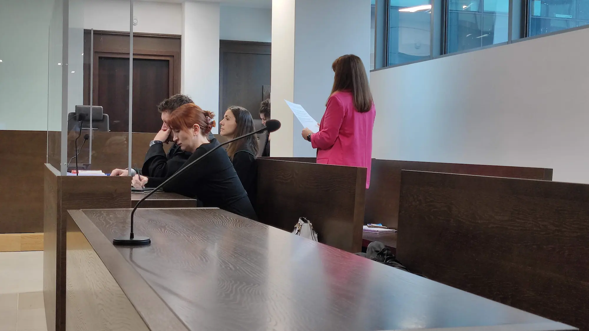

## Skrót informacji { id="w-skrocie" }

-   **Strzeszczenie wydarzeń sprzed rozprawy**

    1. Justyna jest 47-letnią mieszkanką małego miasta, która od ponad dekady poświęca swój wolny czas na pomoc kobietom w niechcianych ciążach.
    2. W 2020 roku Justyna podzieliła się swoimi tabletkami z osobą w niechcianej ciąży, Anią, której zbliżał się 12-sty tydzień.
    3. Ania najpierw próbowała zrobić aborcję w zagranicznej klinice, jednak uniemożliwił jej to despotyczny mąż.
    4. Kontrolujący partner Ani zastawił na nią pułapkę w domu, wzywając przy okazji policję, mężczyźni zabrali kobiecie leki.
    5. Jest to pierwsza w historii Europy sprawa wytoczona działaczce za pomoc w aborcji poprzez przekazanie tabletek.
    6. Justynie grożą 3 lata więzienia – jej pierwsza rozprawa odbyła się 8 kwietnia 2022 roku o 9:30 w Warszawie przy ul. Poligonowej 3.

    [:octicons-arrow-right-16:{ .middle } Pełna historia Justyny i Ani](./posts/justyna/poczatek-kampanii-jak-justyna.md)

    **Streszczenie rozprawy w pierwszje instancji**

    1. Sędzina orzekająca w sprawie została nominowana przez Zbigniewa Ziobrę i nie ukrywa swoich politycznych przynależności:
        * niemożliwiała udział w rozprawie organizacjom zajmującym się prawami człowieka takimi jak *Amnesty International* zmieniając w ostatniej chwili salę na mniejszą
        * jednocześnie zaprosiła do udziału w sprawie, jako *pseudo oskarzyciela* Ordo Iuris, którego polityczne powiązania z rządem PiS[^1] oraz kremlowskimi oligarchami [^2] są powszechnie znane 
        * utrudniała ona wielokrotnie pracę mediów blokując możliwość nagrywania 
        * w końcu utajniła rozprawę
    2. Ordo Iuris wystąpiło na rozprawie Justyny Wydrzyńskiej uzasadniając swoją obecność jako organizacja *"broniąca praw płodu oraz jego potencjalnych następców"*... <small>- [więcej taktykach Ordo Iuris](https://oko.press/ideologia-chrzescijanskich-fundamentalistow-zobacz-jak-dziala-i-manipuluje-ordo-iuris-raport) w raporcie oko.press</small>
    3. Przemocowy mąż kobiety, którą wspierała Justyna unika stawiennictwa w sądzie przez niemal pół roku. 
    4. Działania prokuratury i sądu budzą międzynarodowy sprzeciw:
        * Francja ogłasza wsparcie dla Justyny i dofinansowanie dla Aborcji Bez Granic
        * Belgia ogłasza wsparcie dla Justyny i dofinansowanie dla Aborcji Bez Granic
        * Ambasada Holandii wyraża solidarność z Justyną i zaczyna obserwację procesu
        * ONZ rząda wycofania zarzutów wobec Justyny
        * ONZ wysyła do Polski zespół specjalnych sprawozdawców
        * Setka europarlamentarzystek i europarlamentarzystów wyraża swoje poparcie dla Justyny
        * Europarlament dwukrotnie zaprasza Justynę na prelekcje jako eksptkę ws. praw i zdrowia reprodukcyjnego
        * FIGO rząda wycofania zarzutów wobec Justyny i uznanie jej pracy na rzecz bezpiecznego dostępu do aborcji
        * EBCOG rząda wycofania zarzutów wobec Justyny i uznanie jej pracy na rzecz bezpiecznego dostępu do aborcji
        * 3 największe Szwedzkie organizacje medyczne wzywają prokuraturę do zaprzestania działań przeciwko Justynie
        * Organizacje broniące praw człowieka takie jak Amnesty Internationa, Helsińska Fundacja Praw Człowieka oraz Front Line Defenders uznają Justynę obrończynią praw człowieka.
    5. 14 października 2022 sąd próbuje ukarać świadkinię Annę karą 3 tys złotych za nieobecność. Obrona Justyny intwerweniuje i wnosi o zapewnienie świadkini niezbędnego bezpieczeństwa.
    6. Stowrzyszenie im prof. Zbigniewa Hołdy, skupiające środowisko prawnicze i sędziowskie składa nagrodę na ręce Justyny za jej pro-kobiecą działalność 
    7. 11 stycznia na sali sądowej w końcu pojawił się przemocowy partner kobiety, której pomogła Justyna.
    8. 6 lutego kluczowa świadkini - Ania - pojawiła się na rozprawie. Okazało się, że jej dotychczasowa nieobecność była spowodowana fałszowaniem podpisów na sądowych wezwaniach przez jej partnera. Sąd wycofał jej karę.
    9. Ordo Iuris ujawniło objęte tajemnicą dane świadów - jednak ani sędzina, ani prokurator nie uznali tego za powód do wyłączenia organizacji z przebiegu rozprawy.
    10. Ania, której pomogła Justyna, opublikowała list skierowany do Justyny.

    **Wyrok pierwszej instancji**

    * Na rozprawie 14 marca 2023 Justyna złożyła ostatnie wyjaśnienia i wygłosiła mowę końcową. Sędzina najprawdopodobniej miała przygotowany wyrok od rana, gdyż ogłoszenie wyroku zarządziła na niecałą godzinę po ostatnich słowach obrony.
    * Justyna usłyszała wyrok skazujący. Została co prawda uniewinniona z zarzutu nielegalnym obrotem lekami, jednak *za pomoc innej kobiecie* usłyszła 8 miesięcy ograniczenia wolności w postaci prac społecznych. Wyrok nie jest prawomocny. 
    * Tego samego dnia sędzina Agnieszka Brygidyr-Dorosz otrzymuje awans od ministra Zbigniewa Ziobry.
    * Justyna czeka na uzasadnienie wyroku, by móc się od niego odwołać.
    * Justyna odwołała się od wyroku. Czeka na ustalenie terminu.

    [:octicons-arrow-down-16:{ .middle } Więcej szczegółów o rozprawie Justyny przeczytasz poniżej](#chronologiczny-spis-wydarzeń)    

## Chcesz pomóc Justynie? { id="jak-pomoc" }

Tysiące osób z całego świata okazało Justynie wsparcie, a w solidarności z nią odbyły się dziesiątki demonstracji. 

Za Justyną stanęły również ambasady wielu europejskich państw, oraz organizacje stojące na straży praw człowieka, takie jak Amnesty International oraz organizacje medyczne, takie jak FIGO.

Jeśli ty też chcesz wesprzeć Justynę albo organizacje zajmujące się wspieraniem kobiety w niechcianych ciążach mamy dla ciebie parę propozycji:

-   ### Napisz do koleżanek, że nie są same { id="wspieraj-kolezanki" }

    Daj im znać, że mogą na Ciebie liczyć gdy będą potrzebowały zrobić aborcję. Serio. Zrób to teraz. Zajmie ci to tylko parę sekund.

-   { loading=lazy }
 
-   ### Nagłośnij sprawę { id="naglosnij-sprawe" }

    Skorzystaj ze swoich social mediów, by nagłośnić sprawę Justyny i podzielić się najnowszymi aktualnościami z sądu(1). Możesz dać znać wszystkim, że ty też postąpiłabyś *#jakJustyna*.
    { .annotate }

    1. Najaktywniejsze z tematem rozprawy Justyny jesteśmy na [Instagramie @aborcyjnyDream](https://instagram.com/aborcyjnydream) ale prowadzimy też [Facebooka](https://www.facebook.com/aborcyjnydreamteam), [Twittera](https://twitter.com/aborcyjnydream) oraz [Tik-Toka](https://www.tiktok.com/@aborcyjnydreamteam).

-   ### Podpisz petycję Amnesty International { id="podpisz-petycje" }

    Wejdź na stronę Amnesty International i [podpisz petycję żądając wycofania zarzutów postawionych Justynie](https://amnesty.org.pl/akcje/stan-w-obronie-justyny/) za wspieranie w dostępie do bezpiecznej aborcji!

-   ### Powiedz o swojej aborcji { id="powiedz-o-swojej-aborcji" }

    Największym wsparciem, którego możesz udzielić Justynie jest **normalizowanie** aborcji.

    **Jeśli sama zrobiłaś aborcję** i zastanawiasz się czy chcesz o niej opowiedzieć, to może być dobra okazja na [aborcyjny coming out](../mialam-aborcje/formularz.md) na naszej stronie?

-   ### Walcz z aborcyjną stygmą { id="koniec-wstydu" }

    Mów o aborcji **bez wstydu**. Zapoznaj się z naszymi materiałami o tym [czym jest aborcyjna stygma](../edu/stygmatyzacja.md) oraz [jak rozmawiać o aborcji z bliskimi](../relacje/index.md).

    !!! info "Grafiki solidarnościowe do pobrania"

        Pod tym linkiem zebrałyśmy dla Ciebie w jednym miejscu grafiki solidarnościowe, wykonane przez wspaniałe artystki i artystów.

        [:material-folder-google-drive: Pobierz grafiki solidarnościowe z Justyną ](https://drive.google.com/drive/folders/1d-DirhDkdSLhbQt-Ll39xCVDRp9Y4VzN?usp=sharing){ .md-button }

        Grafiki możesz wykorzystać, by pokazywać całemu światu, że aborcja jest ok, że jest ogrom kobiet, które zachowałyby się #jakJustyna i pomogłyby osobie w niechcianej ciąży.

        ---

        Dziękujemy w tym miejscu wspaniałym: [Aleksandrze Jasionowskiej](https://www.instagram.com/olajasionowska_posters/), [Aleksandrze Herzyk](https://www.instagram.com/aleksandraherzyk/), [Alinowi Szewczykowi](https://www.instagram.com/mymlvn/), [Izabeli Kacprzak](https://www.instagram.com/izabela_kacprzak/), [Kai Kochnowicz](https://www.instagram.com/kaja_kchn_/), oraz [Kasi Babis](https://www.instagram.com/kasiababiscomics/) i [Karolowi Radziszewskiemu](https://www.instagram.com/karolradziszewski/) za te piękne prace.

-   ### Wesprzyj grupy aborcyjne { id="wspieraj-grupy" }

    Jeśli chcesz wesprzeć organizacje aborcyjne działające w Polsce, to rozwarz wpłatę na jedną z nich: [Aborcja Bez Granic](https://abortion.eu/pl#support) kompleksowo wspiera w wyjazdach do zagranicznych klinik oraz prowadzi infolinię aborcyjną. [Women Help Women](https://womenhelp.org/pl/page/359/4-powody-dla-kt%C3%B3rych-twoja-darowizna-jest-wa%C5%BCna) zapewnia polkom dostęp do aborcji farmakologicznej.
    
-   ### Możesz wesprzeć też nas { id="wspieraj-nas" }
    
    Aborcyjny Dream Team - wesprzyj poprzez [zrzutkę](https://zrzutka.pl/adt) oraz [blik lub cykliczną wpłatę](../zrzutka.md). Dzięki twojej wpłacie możemy nie tylko zapewniać kompeksową, emocjonalną i informacyjną pomoc osobom przerywającym ciąże ale też lepiej wspierać Justynę i inne działaczki aborcyjne.

---

## Media o sprawie - zbiór tekstów, wywiadów i relacji { id="w-mediach" }

Jeśli chcesz zapoznać się z przekazem medialnym o sprawie Justyny, zebrałyśmy poniżej listę tekstów 

??? quote ":fontawesome-regular-newspaper: Polskie media o sprawie"

    **wrzesień 2023**

    *  <small>6.09.2023</small> - *Państwo PiS. Wysoki awans dla neo-sędzi, która skazała aktywistkę Justynę Wydrzyńską* [oko.press](https://oko.press/wysoki-awans-dla-neo-sedzi-ktora-skazala-wydrzynska)

    **marzec 2023**

    * <small>2.05.2023</small> - *Zakaz aborcji. „Polska eksportuje swój problem na Zachód”. Czy Unia pomoże polskim kobietom?* [oko.press](https://oko.press/polska-eksportuje-problem-aborcji-na-zachod)
    * <small>25.04.2023</small> - *Cewnikiem Foleya, w ukryciu - tak Anna przerwała ciążę. Wydrzyńska w PE: Wymknęła się śmierci* [oko.press](https://oko.press/cewnikiem-foleya-w-ukryciu-tak-anna-przerwala-ciaze-wydrzynska-w-pe-wymknela-sie-smierci)
    * <small>20.03.2023</small> - *Prawie połowa Polek i Polaków postąpiłaby tak jak Justyna Wydrzyńska, Superbohaterka "WO" [LAUDACJA]* [wysokieobsacy.pl](https://www.wysokieobcasy.pl/akcje-specjalne/7,156847,29577699,prawie-polowa-polek-i-polakow-postapilaby-jak-justyna-superbohaterka.html)
    * <small>20.03.2023</small> - Wywiad *Justyna Wydrzyńska, Superbohaterka "WO" 2022: Państwo karze ludzi za empatię. Ja naprawdę nie żałuję* [wysokieobsacy.pl](https://www.wysokieobcasy.pl/akcje-specjalne/7,156847,29577372,justyna-wydrzynska-superbohaterka-wo-2022-panstwo-karze.html)
    * <small>20.03.2023</small> - *"Takie wyroki lubię". Justyna Wydrzyńska Superbohaterką "WO"* [wysokiobcasy.pl](https://www.wysokieobcasy.pl/akcje-specjalne/7,156847,29579436,superbohaterka-2022-justyna-wydrzynska-z-nagroda-kapituly-wo.html)
    * <small>18.03.2023</small> - *Wyrok za bezczelność. Została skazana, a jednak wygrała (stojąc w brokacie przed neo-sędzią)* - [oko.press](https://oko.press/wydrzynska-skazana-a-jednak-wygrala)
    * <small>16.03.2023</small> - *Sędzia Agnieszka Brygidyr-Dorosz aktywistkę skazała we wtorek 14 marca. W tym samym dniu minister sprawiedliwości udzielił jej delegacji do orzekania w Sądzie Apelacyjnym w Warszawie* [oko.press](https://oko.press/sedzia-wydrzynska-delegacja)
    * <small>15.03.2023</small> - *Szybka ścieżka. Awans sędzi, która skazała aktywistkę aborcyjną* - [Polityka](https://www.polityka.pl/tygodnikpolityka/kraj/2205414,1,szybka-sciezka-awans-sedzi-ktora-skazala-aktywistke-aborcyjna.read)
    * <small>14.03.2023</small> - *Koniec procesu Justyny Wydrzyńskiej. Sąd uznał ją winną "pomocnictwa w aborcji"* [oko.press](https://oko.press/koniec-procesu-justyny-wydrzynskiej-sad-uznal-ja-winna-pomocnictwa-w-aborcji)
    * <small>14.03.2023</small> - *Mowa końcowa Wydrzyńskiej: Jestem niewinna. Państwo jest winne – zawiodło mnie, Annę i miliony kobiet* [oko.press](https://oko.press/mowa-koncowa-wydrzynskiej-jestem-niewinna-panstwo-jest-winne)
    * <small>3.03.2023</small> - *Wzruszający list do Justyny Wydrzyńskiej. "Ile jest warte moje życie?"* - [Radio ZET](https://wiadomosci.radiozet.pl/polska/wzruszajacy-list-do-justyny-wydrzynskiej-ile-jest-warte-moje-zycie)
    * <small>2.03.2023</small> - *„To był wyraz człowieczeństwa". Anna dziękuje Justynie Wydrzyńskiej za pomoc w aborcji. Publikujemy list* - [oko.press](https://oko.press/anna-dziekuje-justynie-wydrzynskiej-za-pomoc-w-aborcji-list)

    **luty 2023**

    **styczeń 2023**

    * <small>11.01.2023</small> - *Kolejna rozprawa w procesie Justyny Wydrzyńskiej. "Żadna kobieta nie powinna być zmuszana do rodzenia"* - [Fakty TVN24](https://fakty.tvn24.pl/ogladaj-online,60/aborcja-w-polsce-rozprawa-w-procesie-justyny-wydrzynskiej,1132460.html)
    * <small>11.01.2023</small> - *Zwrot w procesie Wydrzyńskiej. A co, jeśli tylko aborcja pomaga w ucieczce przed domową przemocą? - [Wysokie Obcasy](https://www.wysokieobcasy.pl/wysokie-obcasy/7,100865,29347722,zwrot-w-procesie-wydrzynskiej-a-co-jesli-tylko-aborcja-pomaga.html?disableRedirects=true)
    * <small>11.01.2023</small> - *Proces Justyny Wydrzyńskiej, oskarżonej o pomoc w aborcji. W sądzie zjawił się świadek* - [oko.press](https://oko.press/proces-justyny-wydrzynskiej-oskarzonej-o-pomoc-w-aborcji-w-sadzie-zjawil-sie-swiadek-relacja)
    * <small>11.01.2023</small> - *Proces o aborcję znowu odroczony. A pod sądem policji tyle co na meczu Legii* - [Polityka](https://www.polityka.pl/tygodnikpolityka/spoleczenstwo/2197152,1,proces-o-aborcje-znowu-odroczony-a-pod-sadem-policji-tyle-co-na-meczu-legii.read)
    * <small>11.01.2023</small> - *"Nic mnie nie powstrzyma, pomogę jak Justyna". Proces oskarżonej o "pomoc w aborcji". Byliśmy z kamerą na miejscu* - [Gazeta Wyborcza](https://wyborcza.pl/7,82983,29344404,nic-mnie-nie-powstrzyma-pomoge-jak-justyna-proces.html)

    **grudzień 2022**

    * <small>17.12.2022</small> - *"Lepsza twarz Polski". Nagrody dla Aborcyjnego Dream Teamu, Waldemara Żurka i Hanny Machińskiej* - [oko.press](https://oko.press/nagroda-im-prof-holdy-2022)

    **listopad 2022**

    **październik 2022**

    * <small>14.10.2022</small> - * "Ktoś musi, do cholery, robić te aborcje w Polsce. Siostrom trzeba pomagać" * [Newsweek](https://www.newsweek.pl/polska/spoleczenstwo/rozprawa-justyny-wydrzynskiej-z-aborcyjnego-dream-teamu-odroczona-do-stycznia/l6f2qb7)
    * <small>14.10.2022</small> - *Sprawa Justyny Wydrzyńskiej. "W sądzie trwa spektakl, a my i tak pomagamy w aborcjach"* - [Gazeta Wyborcza](https://wyborcza.pl/7,82983,29021818,sprawa-justyny-wydrzynskiej-w-sadzie-trwa-spektakl-a-my-i.html)
    * <small>13.10.2022</small> - *Justyna Wydrzyńska może zostać skazana za pomoc w aborcji. Wstawiły się za nią sprawozdawczynie ONZ* - [Gazeta.pl](https://wiadomosci.gazeta.pl/wiadomosci/7,114883,29018882,justyna-wydrzynska-moze-zostac-skazana-za-pomoc-w-aborcji-wstawily.html)
    * <small>13.10.2022</small> - *Stanęła przed sądem za pomoc w aborcji. Zapadnie wyrok w głośnej sprawie?* - [Interia](https://styl.interia.pl/spoleczenstwo/news-stanela-przed-sadem-za-pomoc-w-aborcji-zapadnie-wyrok-w-glos,nId,6345329)
    * <small>13.10.2022</small> - *Aktywistka oskarżona o pomoc w aborcji: „Nie żałuję. Ta kobieta była w strasznej sytuacji”* – [Wysokie Obcasy](https://www.wysokieobcasy.pl/wysokie-obcasy/7,182090,28270066,aktywistka-oskarzona-o-pomoc-w-aborcji-nie-zaluje-ta-kobieta.html) 

    **wrzesień 2022**

    **sierpień 2022**

    * <small>12.08.2022</small> - Wywiad: *Jej proces śledzi Europa. Wydrzyńska: "Nasza złość i opór są coraz większe"* - [Wirtualna Polska](https://kobieta.wp.pl/jej-proces-sledzi-europa-wydrzynska-nasza-zlosc-i-opor-sa-coraz-wieksze-6799908769237504a)

    **lipiec 2022**

    * <small>31.07.2022</small> - *Jak zalegalizować aborcję? Instrukcja z Irlandii Płn. "Jeżeli skażą waszą aktywistkę, będą tego żałować"* - [oko.press](https://oko.press/jak-zalegalizowac-aborcje-instrukcja-z-irlandii-jezeli-skaza-wasza-aktywistke-beda-tego-zalowac)
    * <small>14.07.2022</small> - *Oskarżona o pomoc w aborcji: "Nie boję się. Dostałam wsparcie z całego świata"* - [Gazeta Wyborcza](https://wyborcza.pl/7,82983,28685343,spawa-justyny-oskarzonej-o-pomoc-w-aborcji-ide-do-sadu-z-podniesiona.html)
    * <small>12.07.2022</small> - *Aktywistka znów przed sądem za pomoc w aborcji. ONZ apeluje do polskiego rządu: "wycofajcie zarzuty"* - [Wysokie Obcasy](https://www.wysokieobcasy.pl/wysokie-obcasy/7,163229,28675823,aktywistka-znow-przed-sadem-za-pomoc-w-aborcji-onz-apeluje.html)
    * <small>12.07.2022</small> - *Wysłała własne tabletki poronne. Aborcyjna aktywistka stanie przed sądem* - [Interia](https://kobieta.interia.pl/ciaza-po-polsku/newsamp-wyslala-wlasne-tabletki-poronne-aborcyjna-aktywistka-stanie-,nId,6151515)
    * <small>6.07.2022</small> - *„Aborcja to życie”. Znani mężczyźni w spocie Aborcyjnego Dream Teamu* - [Vogue](https://www.vogue.pl/a/jakub-zulczyk-hubert-urbanski-gargamel-i-inni-w-spocie-aborcyjnego-dream-teamu)
    * <small>3.07.2022</small> - *ONZ do Polski: zalegalizujcie aborcję i wycofajcie zarzuty wobec aktywistki. Rząd: życie jest od poczęcia* - [oko.press](https://oko.press/onz-do-polski-zalegalizujcie-aborcje-i-wycofajcie-zarzuty-wobec-aktywistki-rzad-zycie-jest-od-poczecia)

    **czerwiec 2022**

    **maj 2022**

    **kwiecień 2022**

    * <small>8.04.2022</small> - *Aktywistka stanęła przed sądem za pomoc w aborcji. Udostępniła tabletki poronne ciężarnej kobiecie* - [Fakty TVN24](https://fakty.tvn24.pl/ogladaj-online,60/sprawa-karna-justyny-wydrzynskiej-aktywistka-udostepnila-tabletki-poronne-ciezarnej-kobiecie,1102015.html)
    * <small>8.04.2022</small> - *Oskarżona o pomoc w aborcji Justyna Wydrzyńska w sądzie: "Musiałam pomóc. Bo znam przemoc"* - [oko.press](https://oko.press/oskarzona-o-pomoc-w-aborcji-justyna-wydrzynska-w-sadzie-musialam-pomoc-bo-znam-przemoc)
    * <small>7.04.2022</small> - Wywiad *Wydrzyńska: „Polityka mnie nie interesuje. Chcę wspierać osoby, by mogły godnie przerwać ciążę"* - [oko.press](https://oko.press/wydrzynska-polityka-mnie-nie-interesuje-chce-wspierac-osoby-by-mogly-godnie-przerwac-ciaze-wywiad)
    * <small>7.04.2022</small> - *Grożą mi 3 lata więzienia. Niczego nie żałuję* – [7 metrów pod ziemią](https://www.youtube.com/watch?v=z506Spsh0ss) 

    **marzec 2022**

    * <small>29.03.2022</small> - *Justyna z Aborcyjnego Dream Teamu: „Stoją za mną tysiące kobiet”* - [Vogue](https://www.vogue.pl/a/justyna-z-aborcyjnego-dream-teamu-stoja-za-mna-tysiace-kobiet)
    * <small>28.03.2022</small> - „Będziemy to robić”. Działaczce Aborcyjnego Dream Teamu grożą 3 lata więzienia. Podpisz petycję" – [oko.press](https://oko.press/bedziemy-to-robic-dzialaczce-aborcyjnego-dream-teamu-groza-3-lata-wiezienia-podpisz-petycje/)
    * <small>28.03.2022</small> - Aktywistka stanie przed sądem za pomoc w aborcji. „Jej historia mnie poruszyła. Też doświadczyłam przemocy” – [oFeminin](https://www.ofeminin.pl/swiat-kobiet/to-dla-nas-wazne/aktywistka-oskarzona-o-pomoc-w-aborcji-tabletki-wyslala-ofierze-przemocy/zhg1csw)    
    * <small>28.03.2022</small> - Justynie grozi więzienie za pomoc w aborcji. Oto 5 rzeczy, które możesz dla niej zrobić – [aszdziennik.pl](https://aszdziennik.pl/138043,aktywistka-sad-za-pomoc-w-aborcji-akcja-dla-justyny)

??? quote ":fontawesome-regular-newspaper: Zagraniczne media o sprawie"

    **2023**

    * <small>20.09.2023</small> - *Sakharov Prize 2023: the nominees* [:flag_eu: European Parliament News](https://www.europarl.europa.eu/news/en/headlines/eu-affairs/20230915STO05213/sakharov-prize-2023-the-nominees)
    * <small>7.09.2023</small> - *Václav Havel Human Rights Prize 2023 - "Women in War"* [:flag_cz: aclavhavel.cz](https://www.vaclavhavel.cz/en/vh-prize/11-rocnik-ceny-2023)
    * <small>15.03.2023</small> - *Polish court convicts rights activist for supplying pregnant woman with abortion pills * - [:earth_africa:{ .middle } CNN](https://edition.cnn.com/2023/03/15/europe/poland-abortion-activist-justyna-wydrzyska-intl-hnk/index.html)
    * <small>15.03.2023</small> - *Polish activist found guilty in abortion case to appeal sentence* - [:flag_qa:{ .middle } Aljazeera](https://www.aljazeera.com/news/2023/3/15/polish-activist-found-guilty-in-abortion-case-to-appeal-sentence)
    * <small>15.03.2023</small> - *UN experts urge Poland to acquit woman human rights defender Justyna Wydrzyńska* - [:reko-onz:{ .middle } ONZ](https://www.ohchr.org/en/press-releases/2023/03/un-experts-urge-poland-acquit-woman-human-rights-defender-justyna-wydrzynska)
    * <small>15.03.2023</small> - *En Pologne, une militante du droit à l’avortement condamnée par la justice* - [:flag_fr:{ .middle } Le Monde](https://www.lemonde.fr/international/article/2023/03/14/en-pologne-une-militante-du-droit-a-l-avortement-condamnee-par-la-justice_6165483_3210.html)
    * <small>15.03.2023</small> - *Pologne: «coupable d’assistance» à l’avortement, la Polonaise Justyna Wydrzyńska va faire appel* - [:flag_be:{ .middle } Le Soir](https://www.lesoir.be/501056/article/2023-03-15/pologne-coupable-dassistance-lavortement-la-polonaise-justyna-wydrzynska-va)
    * <small>14.03.2023</small> - *Justyna Wydrzyńska sentence is an attack on women’s rights and sets dangerous EU precedent* - [Renew Europe](https://www.reneweuropegroup.eu/news/2023-03-14/justyna-wydrzynska-sentence-is-an-attack-on-womens-rights-and-sets-dangerous-eu-precedent)
    * <small>14.03.2023</small> - *Center for Reproductive Rights Condemns the Conviction of Polish Human Rights Defender* - [:earth_africa:{ .middle } Center for Reproductive Rights](https://reproductiverights.org/center-condemns-conviction-polish-human-rights-defender/)
    * <small>14.03.2023</small> - *En Pologne, une icône de la lutte pour le droit à l’IVG condamnée* - [:flag_fr:{ .middle } Libération](https://www.liberation.fr/international/europe/en-pologne-une-icone-de-la-lutte-pour-le-droit-a-livg-condamnee-20230315_MKJ4KF6W4VGNJEDCNNVUMC5TN4/)
    * <small>14.03.2023</small> - *Polish abortion: Activist guilty of providing pills to end pregnancy* - [:flag_gb:{ .middle } BBC](https://www.bbc.com/news/world-europe-64950505)
    * <small>14.03.2023</small> - *Polish court convicts activist of providing abortion pills in landmark case* - [:flag_gb:{ .middle } The Washington Post](https://www.washingtonpost.com/world/2023/03/14/poland-abortion-justyna-wydrzynska/)

    **2022**

    * <small>21.12.2022</small> - *Les femmes qui ont marqué 2022* - [:flag_be: { .middle } rtbf.be](https://www.rtbf.be/article/les-femmes-qui-ont-marque-2022-11126506)
    * <small>14.10.2022</small> - *I won't stop, says Polish abortion activist as court hearing adjourned* - [:earth_africa:{ .middle } Reuters](https://www.reuters.com/world/europe/i-wont-stop-says-polish-abortion-activist-court-hearing-adjourned-2022-10-14/)
    * <small>12.10.2022</small> - *Abortion Without Borders Activist May Be Sentenced For Supplying Abortive Pills At Upcoming Hearing* - [:flag_mt:{ .middle } Lovin Malta](https://lovinmalta.com/news/news-international/abortion-without-borders-activist-pills-hearing/)
    * <small>25.08.2022</small> - *«Je ne fais que tendre la main à d’autres femmes» : le combat pour le droit à l’avortement de la Polonaise Justyna Wydrzynska* - [:flag_fr:{ .middle } Le Monde](https://www.lemonde.fr/series-d-ete/article/2022/08/25/je-ne-fais-que-tendre-la-main-a-d-autres-femmes-le-combat-pour-le-droit-a-l-avortement-de-la-polonaise-justyna-wydrzynska_6138949_3451060.html)
    * <small>14.07.2022</small> - *Streng abortlov kan sende polsk kvinde tre år i fængsel: 'Det er fuldstændig skørt'* - [:flag_dk:{ .middle } dr.dk](https://www.dr.dk/nyheder/udland/streng-abortlov-kan-sende-polsk-kvinde-tre-aar-i-faengsel-det-er-fuldstaendig-skoert) 
    * <small>4.04.2022</small> - *Activist faces trial in Poland for aiding abortion* - [:flag_qa:{ .middle } Aljazeera](https://www.aljazeera.com/news/2022/4/4/pro-choice-activist-faces-trial-in-poland-for-aiding-abortion)
    * <small>28.03.2022</small> - *Polish woman is first activist to face trial for violating strict abortion law* – [:flag_gb:{ .middle } The Guardian](https://www.theguardian.com/global-development/2022/mar/28/polish-woman-is-first-to-face-trial-for-violating-strict-abortion-law) 

## Chronologiczny spis wydarzeń { id="chronologiczny-spis-wydarzen" }

Pomiędzy relacjami z poszczególnych rozpraw publikujemy wydarzenia związane z Justyną Wydrzyńską jak i kolejne międzynarodowe rządania uchylenia zarzutów przeciwko niej. Materiał jest aktualizowany na bierząco.

### Nominacja do nagrody Parlamentu Europejskiego "Za wolność myśli" im. Sacharowa 2023 <small>19 września 2023</small> { id="nominajca-nagroda-sacharowa" }

Wśród irańskich kobiet, afgańskich działaczy edukacyjnych a także takich nazwisk jak Mahsa Amini, Marzia Amiri, Parasto Hakim, Matiullah Wesa, Vanessa Nakate europarlament nomiował również *kobiety walczące o bezpłatną, bezpieczną i legalną aborcję*: Justynę Wydrzyńską, Morena Herrera i Colleen McNicholas.

> Justyna Wydrzyńska broni praw polskich kobiet i jest członkiną Aborcyjnego Dream Teamu. Została skazana na osiem miesięcy prac społecznych za pomoc kobiecie w uzyskaniu aborcji w Polsce. Morena Herrera jest feministką i działaczką społeczną, opowiadającą się za bezpiecznym i legalnym dostępem do aborcji w Salwadorze. Colleen McNicholas to amerykańska położnik-ginekolog z dużym doświadczeniem w zapewnianiu wysokiej jakości opieki i skutecznym propagowaniu zdrowia reprodukcyjnego.

### Nominacja do nagrody Human Right Vaclava Havla <small>7 września 2023</small> { id="nominacja-vaclav-havel" }

Justyna Wydrzyńska została nominowana do nagrody imienia Vaclava Havla "Women in War". Oprócz niej nominacje otrzymały: Osman Kavala oraz Yevhen Zacharov.

### Kolejny awans sędziny, która skazała Justynę <small>6 września 2023</small> { id="kolejny-awans-sedzi" }

Sędzina która skazała Justynę, Agnieszka Brygidyr-Dorosz, otrzymała *kolejny* awans od nowej Krajowej Rady Sądownictwa do Sądu Apelacyjnego w Warszawie. 

> Procedura zajęła 10 minut i wyglądała na formalność. Jeśli prezydent ją powoła, Brygidyr-Dorosz trafi do strategicznego dla władzy wydziału karnego Sądu Apelacyjnego w Warszawie - pisze portal oko.press.

### Europarlanet wysłuchanie obywatelskie <small>25 kwietnia 2023</small> { id="europarlament-wysluchanie-obywatelskie" }

Justyna wystąpiła w europarlamencie na Komisji Praw Kobiet i Równouprawnienia (FEMM). Trzymając w ręku tabletki do aborcji farmakologicznej i cewnik Foleya, opowiedziała o własnym procesie sądowym i o Annie, która próbowała przerwać swoją ciążę. Otrzymała deklaracje wsparcia od Europarlamentarzystek i Europarlamentarzystów.

### Czekamy na ustalenie daty rozprawy apelacyjnej <small>kwiecień 2023</small> { id="czekanie-na-apelacje" }

Poznałyśmy uzasadnienie i odwołałyśmy się od decyzji sądu. Czekamy na ustalenie trminu rozprawy.

### Nagroda Superbohaterki Wysokich Obcasów <small>20 marca 2023</small> { id="nagroda-suprbohaterki-wo" }

Justyna została Superbohaterką WO w 8 edycja plebiscytu.

To nagrody przyznawane przez redakcję "Wysokich Obcasów" oraz (osobno) przez ich czytelniczki. Justyna wygrała obie nagrody.

> Doceniamy odwagę, empatię, wrażliwość, wiarę w to, że można żyć inaczej. Bo Superbohaterka ma w sobie nieustępliwość, determinację, wyobraźnię. I potrzebę działania.

### Odwołanie się od wyroku sądu <small>marzec 2023</small> { id="odwolanie" }

Czekamy na uzasadnienie wyroku. Następnie będziemy odwoływać się od decyzji sądu.

### Awans sędziny która skazała Justynę <small>14 marca 2023</small> { id="awans-sedziny" }

Jak ustalili dziennikarze Agnieszka Brygidyr-Dorosz, otrzymała awans zarządzony przez ministra sprawiedliwości Zbigniewa Ziobrę. Ciężko uznać to za zbieg zwykły okoliczności, a nie publiczną nagrodę od minsitra za represjonowanie aktywistki. Agnieszka Brygidyr-Dorosz jest jedną z neo-sędziów i od ponad dwóch miesięcy starała się o awans, otrzymała je jednak dopiero 14 marca.

Obrońca Justyny, Jerzy Podgórski komentuje:

> Nie wiem, co mam powiedzieć. To tak zaskakująca i uderzająca informacja. Składaliśmy wniosek o wyłączenie sędzi z uwagi na to, że jest neo-sędzią. Na pewno będziemy w apelacji podnosili jako główny zarzut nienależytą obsadę sądu. [...] Byliśmy zaskoczeni szybkim wydaniem wyroku, nie spodziewaliśmy się go we wtorek. W tej sprawie był wyznaczony kolejny termin rozprawy na 27 marca. [...] Praktyka sądów karnych, w szczególności sądów okręgowych jest taka, że wyroki nie są ogłaszane jeszcze tego samego dnia. W sprawach zawiłych i z innych ważnych powodów sąd może odroczyć wyrok do 14 dni.

Jednak sędzina miała gotowy wyroku już parenaście minut po mowie końcowej Justyny. Można domniemywać, że był on już gotowy od samego rana, a awans który otrzymała Agnieszka Brygidyr-Dorosz jest bardzo hojnym przyklaśnięciem jej decyzji. Jednak ten skandaliczny i jawnie upolitycziony gest może obrócić się przeciwko Ziobrze. Jak wskazuje obrona:

> Kwestię delegacji też będziemy podnosić w apelacji. Wiemy, jakie poglądy ws. aborcji ma decydujący o delegacjach minister. Można mieć obawy, czy sędzia ubiegający się o delegację jest bezstronny. To jest podstawa do jego wyłączenia.

Sąd otrzymał informacje o awansie sędziny Agnieszki Brygidyr-Dorosz o 10:56 - czyli już po rozpoczęciu rozprawy Justyny.

### Ostatnia rozprawa Justyny Wydrzyńskiej <small>14 marca 2023</small> { id="ostatnia-rozprawa" }

Podczas ostatniej rozprawy Justyna odniosła się do *nowych dowodów* złożonych przez prokuratora: były to... kolejne wystąpienia Justyny w Polskim sejmie, Europarlamencie i mediach.  

Justyna ustosunkowała się do tych oczywistości, którymi prokurator chciał załatać nikły materiał dowodowy w sprawie:

> Udzielam informacji, które są zgodne z rekomendacjami WHO, tym się zajmuje. W ten sposób wspieram osoby, które się do nas zgłaszają. By wybierały bezpieczne,  metody rekomendowane przez Światową Organizację Zdrowia, a nie przyjmowały niesprawdzone leki, wykonywały zabiegi chirurgiczne w prywatnych gabinetach lekarskich, czy wpuszczały płynów do macicy.  Zawsze moim celem było bezpieczeństwo i komfort osoby przerywającej ciążę. Organizacje aktywistyczne które oferują dostęp do aborcji w Polsce są obdarzone ogromnym zaufanie społecznym. Osoby w Polsce nie mogą polegać na lekarzach, bo tracą życie. 

Prokuratura chociaż wcześniej straszyła 3 latami więzienia, położyła uszy po sobie i wnioskowała jedynie o prace społeczne. Według nas związane jest to z ponad 70% poparciem dla aborcji i zbliżającym się sezonem wybroczym.

Po wystąpieniach prokuratury, prawniczki Ordo Iuris i obrony Justyny nastąpił czas na mowę końcową Justyny. Sędzina zapowiedziała, że odczyta wyrok po godzinnej przerwie (co znaczy, że był on już najpewniej gotowy przed tą rozprawą).

#### Mowa końcowa Justyny Wydrzyńskiej { id="mowa-koncowa-justyny" }

Justyna wygłosiła swoją mowę końcową.

??? quote "Cała mowa końcowa Justyny Wydrzyńskiej"

    Wysoki sądzie

    Stoję tu dzisiaj, bo wysłałam swoje tabletki do aborcji farmakologicznej. Wysłałam je drugiej kobiecie – to niezaprzeczalny fakt. Grożą mi 3 lata więzienia.

    Nie zrobiłam tego z własnej inicjatywy, bo nie zajmuję się rozsyłaniem tabletek do aborcji. Wiedziałam, że Ania była wówczas skrajnie zdesperowana, a ja miałam zestaw tabletek na własny użytek.

    Tabletki, które posiadałam na własne użytek i które wysłałam Ani, są obecnie w Polsce najbezpieczniejszą metoda przerywania ciąży. Używane są powszechnie w Europie i na świecie przez miliony osób. Nie wymagają znieczulenia, nie powodują ryzyka powikłań i są bezpieczniejsze niż proste zabiegi medyczne. Wiem to z oficjalnych raportów Światowej Organizacji Zdrowia, które rekomendują, by mife&miso były substancjami dostępnymi powszechnie. Nie ma ku temu żadnych przeciwwskazań.

    Wysłałam Ani tabletki dlatego, że dowiedziałam sie, że jak ja doświadczała przemocy. Obie byłyśmy kontrolowane, szantażowane, zostawione sama sobie. Mamy dzieci, chciałyśmy je chronić.

    Ja też doświadczyłam przemocy ze strony partnera. Byłam kontrolowana i spotykała mnie nie tylko przemoc finansowa, ale fizyczna i psychiczna. To wszystko było wszechobecne w “moim” domu.

    My, kobiety które doświadczyłyśmy przemocy domowej wiemy jakie ofiary musimy ponieść by pierwszej kolejności chronić dobro dzieci, które już mamy. Ja mam ich troje. Matki mierzące się z przemocą domową zrobią wszystko, by dzieci miały spokojne noce i aby one same mogły przestać żyć w ciągłym, wyniszczającym, napięciu. My osoby doświadczające przemocy, utrzymujemy to co przeżywamy w tajemnicy, wstydzimy się, że nie miałyśymy na tyle odwagi by zawalczyć o swoją wolność, że dopuściłyśmy do ograniczania nas. Pozostajemy często same z wyboru i konieczności.

    Te oczywiste fakty mają potężny związek z potrzebą kontrolowania swojej płodności. Żyjąc w przemocy często nie uświadamiamy sobie, że utraciłyśmy kontrolę nad swoim ciałem i nad resztą swojego życia. Bo w domu jest osoba, która w wielu aspektach, nawet wbrew tobie, podejmuje decyzje za ciebie. W moim przypadku przerwanie ciąży, w której nie chciałam być z mężczyzną który mnie krzywdził, przemocowcem, uzmysłowiło mi, że mam władzę nad własnym życiem i tę kontrolę jestem w stanie sobie sama zwrócić. Poczułam, że mogę decydować, a strach który czułam jest nie tylko wywołany lękiem o ciało, ale też o wolność, która jest nadrzędnym prawem każdego człowieka.

    Uzyskałam rozwód w 2009 roku, po 11 latach małżeństwa. Po to by uchronić siebie i trójkę swoich dzieci. Jednak wspomnienia przemocy są ciągle we mnie. Tego się nie zapomina. I tego nie życzy się też nikomu.

    Moja własna aborcja była dla mnie przełomem. Nie chciałabym żyć w świecie, w którym jakakolwiek kobiecie brakowałoby dostępu do rzetelnej informacji i najprostszego ludzkiego wsparcia. To od lat moja motywacja która kieruje mną w aktywizmie – w działaniach pro-społecznych. Dla mnie ten proces, chociażby symbolicznie, jest zarazem procesem wszystkich innych osób, które pomagają innym w potrzebie. 

    Czuję, że nie stoję przed sądem sama. Stoją za mną moje koleżanki ale też setki kobiet, których nie miałam jeszcze szczęścia poznać.

    Na tej sali dotykamy podstawowych prawa człowieka. W tym prawa do samostanowienia. Wstawiły się za mną liczne organizacje, które w tym temacie mają rozległą wiedzę: takie jak Amnesty International czy Human Rights Watch i Fundacja Helsińska, które mówią wprost – jestem obrończynią praw człowieka. Nie są w tej opini osamotnione – organizacja “Katolików na rzecz wyboru”, parlament Belgii, ponad 80 europosłanek i europosłów czy wysokiej rangi specjalne sprawodawczynie ONZ do spraw kobiet zwróciły się do polskiego rządu wskazując, że ja nigdy nie powinnam była dostać zarzutu, który jest mi stawiany. Nigdy nie powinnam być prześladowana za działalność która chroni zdrowie i życie kobiet. Dowodzi tego również Międzynarodowa federacja ginekologów i położników, wyraźnie żądając oczyszczenia mnie z jakichkolwiek zarzutów i podkreślając, że moje działania są nie tylko bezpieczne, ale również rekomendowane przez Światową Organizację Zdrowia. 

    I sąd wie o tym, gdyż wiele z tych organizacji eksperckich złożyło listy przyjaciela sądu. I nie są to osamotnione głosy tylko ekspertów, ale też zdanie setek tysięcy osób, które podpisało petycję do prokuratury. Wszystkie te głosy powtarzają – ten proces zwyczajnie nie powinien się wydarzyć. Jestem wdzięczna za to ogromne wsparcie.

    Ale Wysoki Sądzie jestem tutaj. Na ławie oskarżonych. A ostatni rok dla mnie i mojej rodziny, dla moich bliskich, są bardzo trudne. Czuję, że nie jestem winna. To co usłyszałam na tej sali, to jakie dokładnie były okoliczności sytuacji życiowej Ani, tylko utwierdziły mnie w przekonaniu, że zrobiłam dobrze. Uświadomiły mi, że należy ufać intuicji i podejmować ryzyka jeśli chodzi o wspieranie osób w potrzebie. Nigdy nie chciałabym dla żadnej kobiety aby musiała przez trudne sytuacje przechodzić sama, nie mieć wsparcia od nikogo czy nawet by najbliższa rodzina była dla niej wrogiem i działała przeciwko. Wierzę, że pomoc drugiemu człowiekowi, gdy prosi o pomoc w desperacji walcząc o wolność jest naszą koniecznością, to element człowieczeństwa, którego się nie wyrzeknę, nie będę się wstydzić, czy uważać to za przestępstwo.

    Wysoki Sądzie, żyjemy w państwie które nie szanuje kobiet. Polska ustawa antyaborcyjna z lat 90 była jedną najbardziej surowych w Europie. Surową dlatego, że zmuszała osoby w niechcianych ciążach do robienia sobie aborcji w ukryciu.

    Dla nich organizacje aktywistyczne stanowią jedyny ratunek przed wątpliwymi handlarzami czy niebezpiecznymi metodami. Inicjatywy takie jak Aborcja Bez Granic wykonują pracę, która od lat powinna należeć do państwa i być częścią publicznego systemu ochrony zdrowia. Pracuję w tym obszarze od 16 lat i niestety obserwuję, jak decyzje ze strony państwa powodują zmianę sytuacji kobiet na gorsze.

    Ustawa antyaborcyjna jest nie tylko okrutna ale też fikcyjna. Prawo nie powstrzymuje osób w niechcianych ciążach przed aborcją – to nie moja opinia – pokazują to wszystkie badania dotyczące aborcji. Pokazują to raporty naukowców z całego świata. 

    Kobieta w niechcianej ciąży, myśli przede wszystkim praktycznie – o tym jak znaleźć dostęp do aborcji, ile to będzie kosztować i czy ją na to stać. I ona zrobi aborcję, niezależnie od tego, jakie jest prawo, i czy metoda, którą zastosuje jest dla niej bezpieczna czy nie. Tak myślałam ja, tak myślała też Ani tak myśli i działa około 100 tysięcy Polek rocznie, a obecnie również uchodźczynie z Ukrainy. I te kobiety się nie mylą.

    Po 22 października 2020 roku, kiedy pseudo trybunał zaostrzył kolejny raz prawo aborcyjne w Polsce, osoby z wadami płodu zaczęły znajdować ratunek w Holandii, gdzie aborcja jest dostępna do 22 tygodnia. Kobiety w ciąży ze stwierdzonymi wadami płodu pytają: “Czemu muszę wyjeżdżać do obcego kraju, czuć się jak uciekinierka, dlaczego nie mogę tego zrobić u siebie w szpitalu a po wszystkim jak najszybciej wrócić do domu?” A lekarki z holenderskich klinik mówią wprost: “Polki to najliczniejsza grupa wśród naszych zagranicznych pacjentek, są to pacjentki ze szczególnymi potrzebami, często są pokiereszowane przez to co spotkało je w polskich szpitalach i trzeba je uspokajać i zapewniać, że otrzymają pomoc.” Do holenderskich klinik po 2020 roku przyjeżdżają z miesiąca na miesiąc w coraz bardziej krytycznym zagrożeniu własnego życia.

    Osób potrzebujących aborcji, tu i teraz, w niebezpiecznej sytuacji jest bardzo dużo. Te niebezpieczeństwa to nie tylko okrutne prawo, nie tylko zaniedbania, tchórzliwość i koniunkturalność lekarzy ale też bycie w przemocowej relacji, pod ciągłą kontrolą.

    Uwolnienie się od niechcianej ciąży w przemocowej relacji otwiera drogę do uwolnienia się od przemocy w ogóle. 

    Dla mnie właśnie takim było, aborcja była czynnikiem, który uświadomił mi, jak bardzo jestem ograniczana i jak bardzo potrzebuje wolności i możliwości decydowania samej o sobie. Tego samego chciałam dla Ani, by tak jak ja mogła doświadczyć sprawczości nad swoim życiem, ciałem. 

    Nie chciałam, aby Ania musiała ryzykować swoim życiem podejmując niebezpieczne kroki, skoro rozwiązanie jest tak łatwe, a zarazem bez wątpienia medycznie bezpieczne. 

    Nie chcę, aby ktokolwiek musiał przechodzić sam w strachu przez niebezpieczna aborcję, kiedy istnieją bezpieczne, nie stygmatyzujące alternatywy. Nie chcę, by którakolwiek z nas musiała rezygnować ze swojego prawa do wolności i samostanowienia.  

    Kierowała mną chęć pomocy, wtedy gdy nikt już pomóc nie chciał lub pomóc już nie mógł. Dla mnie pomoc Ani była czymś oczywistym, przyzwoitym i uczciwym. Warto być uczciwym, choć nie zawsze się to opłaca.

    Gdybym miała pełną wiedzę na temat rzeczywistości w jakiej żyła Ania, nie tylko wysłałabym jej tabletki, ale pozostałabym w kontakcie, aby wspierać ją w trakcie przyjmowania leków, by nie czuła się samotna, by miała kogoś kto ją wysłucha i nie zostawi ją samą sobie, potrzyma za rękę.

    Zgromadziliśmy się tu, aby zdecydować o mojej winie. Ja jestem niewinna mówię głośno – to państwo jest winne i zawiodło mnie, Anię, Izę z Pszczyny, Agnieszkę z Częstochowy i miliony kobiet w tym kraju.

    Wnoszę o uniewinnienie.
    
#### Podawanie sobie tabletek aborcyjnych pod salą sądową { id="podawanie-tabletek" }

Jeszcze przed wyrokiem aktywistki aborcyjne z całego świata, dziennikarki i kobiety zaczęły wymieniać się tabletkami aborcyjnymi, by pokazać, że to co zrobiła Justyna jest normalną czynnością i absurdem jest nazywanie tego przestępstem.

#### Wyrok w sprawie Justyny Wydrzyńskiej { id="wyrok" }

Po godzinnej przerwie sędzina odczytała wyrok skazujący - *“winna udzielenia pomocy”*. Justyna została uniewinniona za rzekome dystrybuowanie leków, czego nie udało się dowieść prokuraturze.

Justyna otrzymała osiem miesięcy ograniczenia wolności w postaci prac społecznych w wymiarze 30h/miesiąc. Jednak nie ukrywamy – od wyroku się odwołamy. Justyna śmieje się:

> “Prace społeczne? Zaraz odrobię!” i odbiera już teraz telefon infolinii aborcyjnej Aborcji Bez Granic.

W swoim uzasadnieniu sąd mówił, m.in:

> To nie jest tak że człowiek może sobie wybierać, że jak jest w jednej ciąży to ją doniesie z wyboru, a w innej może podjąć decyzję, że nie.

Sędzina również mówiła, że według niej, Justyna nie powinna ryzykować i udzielać pomocy kobiecie doświadczającej przemocy domowej, dopóki nie potwierdziła, że dzieje się jej krzywda... Na szczęście Justyna jest zupełenie inną osobą niż sędzia!

Justyna Wydrzyńska usłyszała wyrok skazujący, jednak aktywistki nie opuszczają głów, odwołują się i wracają do pracy.

Dla nas najważniejszy wyrok to słowa Ani skierowane do Justyny w liście: *„Dziękuję za okazanie mi pomocnej dłoni, gdy inni zawiedli”*.

### Wydarzenia przed ostatnią rozprawą { id="przed-ostatnia-rozprawa" }

#### Wystąpienie Justyny w polskim sejmie na konferencji "Robimy robotę - Kobiety na wybory!" <small>6 marca 2023</small> { id="wystapienie-w-sejmie" }

Justyna Wydrzyńska, tym razem na zaproszenie Lewicy, ponownie pojawiła się w Sejmie, aby mówić o prawach kobiet do wyboru w kwestiach reprodukcyjnych. Jej obecność jest ważna, ponieważ ze względu na toczącą się przeciwko jej sprawę, jest obecnie jedną z najbardziej rozpoznawalnych postaci w polskim ruchu feministycznym. Wykorzystując swoje doświadczenie Wydrzyńska mówiła o tym co muszą zrobić posłowie i posłanki, by zapewnić kobietom bezpieczeczny dostęp do aborcj.

[:material-youtube:{ .middle } transmicja na kanale YT lewicy](https://www.youtube.com/live/uc4XvoYY-rc?feature=share&t=3899)

#### List Ani do Justyny <small>2 marca 2023</small> { id="list-ani-do-justyny" }

OKO.press opublikowało list Anny, której Justyna przekazała pigułki aborcyjne. Po rozprawie 6 lutego, na której Ania złożyła swoje zeznania, mogła w końcu swobodnie nawiązać kontakt z Justyną. Zrobiła to poprzez poruszający list.

??? quote "Cały list Ani do Justyny Wydrzyńskiej"

    > Ja od wielu dni wyobrażałam sobie ten moment, kiedy przyjdzie mi stanąć przed panią i spojrzeć pani prosto w oczy.

    > Zastanawiałam się, jak powinnam się zachować, a przede wszystkim, co powinnam powiedzieć. Jakich słów użyć, aby były one adekwatne do sytuacji.

    > I muszę przyznać, że nie udało mi się znaleźć takich słów. No bo ile jest warte życie ludzkie? A moje życie ile jest warte? Czy ono w ogóle przedstawia jakąś obiektywną wartość? Ja nie potrafię udzielić odpowiedzi na te pytania. Ale mogę powiedzieć jedno. Ja chce żyć i mam dla kogo żyć.

    > Dlatego uznałam, że w tej sytuacji najlepiej będzie użyć tego zwykłego słowa "dziękuję". Ja przepraszam, ale lepszego słowa naprawdę nie udało mi się znaleźć.

    > Pani Justyno, dziękuję pani za to, że w najtrudniejszym momencie mojego życia, kiedy osoby najbliższe, bliskie, a także lekarki i lekarze - zawiedli, pani jako jedyna z nielicznych udzieliła mi pomocy.

    > Czytając w mediach wywiady z panią w związku z tą sprawą, dowiedziałam się, że w pani ocenie to był wyraz empatii. Przepraszam, ale nie zgodzę się z panią.

    > Nie. To nie był wyraz empatii. To był wyraz człowieczeństwa. Bo w sytuacji, gdy osoby, na których ciążył moralny, a na części z nich także prawny obowiązek udzielenie mi pomocy, stały z boku umywając ręce, a pani podała mi swoją dłoń. To naprawdę wielka rzecz. I ja tego pani gratuluję.

    > I dziś po upływie trzech lat od tamtych wydarzeń, najbardziej wzruszają mnie pani słowa, że pomimo tego, co panią spotkało, nie żałuje pani i zrobiłaby pani to samo jeszcze raz. Ja czuję, że te słowa zostały skierowane do mnie i dziękuję za nie. To są jedne z najważniejszych słów, jakie ja kiedykolwiek w życiu usłyszałam od drugiego człowieka. Dziękuję. 

#### List stowarzyszenia katolickich lekarzy do Ziobry <small>15 lutego 2023</small> { id="kslp-do-ziobry" }

*Katolickie Stowarzyszenie Lekarzy Polskich*, włącza się w proces Justyny Wydrzyńskiej wysłało list do Ziobry[^3], którego jednym z czołowych sygnetariuszy został... Bogdach Chazan(1). Wzywa ono sąd do do wydania wyroku przeciwko Justynie. KSLP zauważa, że organizacje aborcjne takie jak ADT i sieć Aborcja Bez Granic *"bez żadnych przeszkód dostarcza matkom środki wywołujące aborcję farmakologiczną"*. Gratulujemy Stowarzyszeniu "spostrzegawczości" nie usprawieliwia ona jednak podawania nieprawdziwych informacji.
{ .annotate }

1. Bogdach Chazan znany jest przede wszystkim od czasu gdy [w 2014 roku postanowił ukryć przed pacjentką ciężkie wady płodu](../edu/historia/w-polsce.md/#sprawa-bogdana-chazana) - starcił on wtedy stanowisko dyrektora stołecznego szpitala ginekologicznego i zaangażował się w ruch przeciwników aborcji.

??? warning "Anty-naukowe kłamstwa w liście KSLP - sprostowanie i wyjasnienie lekarskich manipulacji:"

    *Katolickie Stowarzyszenie Lekarzy Polskich* (jak i wiele polskich lekarzy, którzy straszą opinię publiczą) nie zapoznało się z oficjalnymi wytycznymi WHO (które wskazują, że aborcja farmakologiczna jest rekomendowaną, najbezpieczniejszą i najmniej inwazycją, formą aborcji do 12 tygodnia ciąży) lub celowo je przemilcza, by zastraszyć opinię publiczną Mifepristonem i Misoprostolem.

    **Nie mogłybyśmy tego nie sprostować:**

    *Katolickie Stowarzyszenie Lekarzy Polskich* pisze <small>(jest to fałszywe oświadczenie i prosimy o nie kopiowanie go bezmyślnie):</small>

    > Pacjentka winna być poinformowana o występowaniu długotrwałego krwawienia z pochwy (średnio przez 12 dni lub dłużej od zażycia Mifegyne), które może charakteryzować się znacznym stopniem nasilenia. Do krwawienia dochodzi w niemal wszystkich przypadkach, ale nie stanowi ono dowodu na całkowite wydalenie płodu. Przy stosowaniu środka Misoprostol występuje biegunka, wysypka, zawroty głowy pochodzenia ośrodkowego, bóle głowy i brzucha, zaparcia, niestrawność, wzdęcia, nudności, wymioty, zaburzenia menstruacyjne, skurcze macicy, gorączka. senność, drżenie, drgawki, duszność, gorączka, kołatanie serca, hipotonia, bradykardia.[^3]

    Z przytoczonego przez KSLP framentu, którego **źródło KSLP nie podaje**, można było by wnioskować, że nie tylko Mifepristone i Mizoprostol miałbybyć mało skuteczne, a krwawienie z pochwy po ich zażyciu *abnormalne*, ale też, że ich działanie *domyślnie* związane jest z dużą ilością efektów niepożądanych. **Jednak nie jest to prawda, a jedynie zbitek wyrwanych z kontekstu straszaków**.
    
    * **Krwawienie:** krwawienie po wzięciu tabletek do przerwania ciąży jest **pożądanym efektem leków aborcyjnych** gdyż ich celem jest **wywowałnie poroniena** które ze swojej natury polega na usunięciu płodu i tym samym krwawienia[^9].
    * Ponadto *"Silne krwawienie odnotowuje się w około 5% przypadków"* ale *"w maksymalnie 1,4% przypadków może ono wymagać wyłyżeczkowania w celu zahamowania krwawienia."* [^4].
    * **Najczęstrzy przebieg** aborcji po zażyciu leków można porównać do obfitej **miesiączki** (co może jest przerażającą wizją dla Bogdana Chazana, ale **jest powszechnym doświadczeniem każdej miesiączkującej osoby**).
    * **Litania skutków ubocznych** którą wymienia KSLP nie występuje powszechnie ale "bardzo rzadko"[^5] co więcej spowodowane są one najczęściej *przedawkowaniem leków*.
    * **Poważne skutki uboczne** również związane są z niepoprawnym zażyciem leków, a szanse ich wystąpienia są mniejsze niż 1/10000 pacjentek [^6].
    * **Skuteczność** aborcji za pierwszym razem po poprawnie zażytych lekach wynosi ponad 99%, i spada do ok 95% w przydaku bardziej rozwiniętych ciąż.[^7]
    
    Większość tych informacji dostępna jest w ulotce i stanowisku CHMP do którego KSLP samo linkuje. 
    
    Ponadto informujemy Stowarzyszenie, że **każdy lek** posiada informację o potencjalnych rzadkich skutach ubocznych. Jako lekarze powinni profesjonalnie informować faktach, a nie nieudolnie manipulować treścią ulotki, by zastaszać pancjetni. Winni są oni tego tym bardziej, że **głównym powodem zagrożeń związanych z lekami, jest brak wiedzy o tym jak bezpiecznie je dawkować.**

    Jesteśmy w stanie założyć, że Stowarzyszeniu nie udało się przeczytać całego 29 stronnicowego domumentu, jednak już na 7 stronie CHMP podsumowuje[^8]:

    > CHMP uznał, że stosunek korzyści do ryzyka dla produktów leczniczych zawierających mifepriston w uzgodnionych wskazaniach jest korzystny. W związku z tym CHMP zalecił utrzymanie pozwoleń na dopuszczenie do obrotu dla produktów leczniczych.

### Piąta rozprawa Justyny Wydrzyńskiej <small>6 lutego 2023</small> { id="piata-rozprawa" }

To jednak z najbardziej emocjonujących ale też skandalicznych z dotychczasowych rozpraw.

- Zarówno Ania jak i obrońcy Justyny skałają wniosek o odsunięcie Ordo Iuris od sprawy, ze względu na ujawnienie przez fundację informacji objętych tajemnicą
    * Ordo Iuris broniło się, że "żadnych danych nie ujawniło", "a jeśli tak to na pewno je usunęło od razu" i "to był tylko błąd pracownika"
    * Mimo to zarówno sędzina jak i prokurator nie wycofali swojej zgody na udział Ordo Iuris, które zostało na sali.
    * W trakcie przerwy w rozprawie, obecna na korytarzu pracowniczka *Fundacji Pro - Prawo do Życia* Katarzyna Uroda z dumą przyznała się do sfotografowania objętych tajemnicą danych i do przekazania ich pracownikom Ordo Iuris.
- Głównym punktem rozprawy były zeznania Ani
    * nie były one dla wielu osób wielkim zaskoczeniem, gdyż o jej historii pisałyśmy już na początku 2022 roku
    * jednak jej opowieść, szczegóły dotyczące jej okoliczności życiowych tylko utwierdziły nas w przekonaniu, jak silną i dzielną osobą jest Ania oraz jak ważne i potrzebne było to, co zrobiła Justyna
- Dowiedzieliśmy się dlaczego Ania nie stawiła się na wcześniejszych rozprawach gdyż wezwania do stawiennictwa odbierał za nią (fałszując jej podpisy) jej przemocowy partner. Sąd poinformował właściwe organy o możliwości popełnienia przestępstwa.
- Ponadto sąd potwierdził, że owemu mężczyźnie, z powodu agresywnych zachowań została założona Niebieska Karta.

### Wydarzenia po czwartej rozprawie { id="po-czwartej-rozprawie" }

#### Kolejne wystąpienie Justyny w Europarlamencie <small>1 lutego 2023</small> { id="wystapienie-w-eurpoarlamencie" }

Justyna została zaproszona przez Europarlament do wystąpienia na [panelu o prawach reprodukcyjnych](https://app.livecasts.eu/simone-veil-pact-empowering-women-now/program "Zapis transmisji: Simone Veil Pact: Empowering Women Now - Renew Europe") (Sexual and reproductive rights at stake) zorganizowanym przez Renew Europe. Posłanki z całej Europy dziękowały Justynie za jej pracę i mówiły o tym, że to nie one - posłanki, ale właśnie takie kobiety jak Justyna, są najważniejszymi bohaterkami współczesnej walki o prawa reprodukcyjne.

> „Justyna, wiedz, że jesteśmy z tobą i stoimy za tobą murem. Wspieramy cię i dziękujemy ci za wszystko co robisz. Mamy nadzieję że wiesz jak wielki wpływ wywierasz swoim aktywizmem. Zrobimy wszystko co w naszej mocy żeby cię ochronić.”

Więcej: [Justyna Wydrzyńska mówi o aborcji w Europarlamencie](./posts/swiat/justyna-wydrzynska-w-europarlamencie.md)

#### Ordo Iuris ujawnia utajnione przez sąd dane kluczowej świadkini <small>styczeń 2023</small> { id="ordo-ujawnia-dane-ani" }

W mediach społecznościowych Ordo Iuris ujawnia dane Ani, prawdopodobnie w celu zastarszenia kobiety bezpośrednio przed rozprawą i złożeniem przez nią zeznań. Dane znikają dopiero po interwencji prawnikow.

### Czwarta rozprawa Justyny Wydrzyńskiej <small>11 stycznia 2023</small> { id="czwarta-rozprawa" }

Czwarta rozprwa była poświecona przesłuchaniu mężczyzny, który próbował zmusić Anię do urodzenia mu dziecka, a gdy ta odmówiła, nasłał na nią policję. Nie możemy niestety ujawnić treści jego skandalicznych zeznań, jednak możemy przypomnieć zarówno histowię Ani oraz to, o czym informowałyśmy wcześniej:

*Zacietrzewionym i dumnym z siebie sprawcom przemocy domowej nie można ufać. Mężczyźni którzy śledzą swoje partnerki, czytają ich prywatne wiadomości, terroryzują je, więżą zamknięte w domu i przede wszystkim tym, którzy zmuszają do niechcianej ciąży, nie są godni zaufania.*

Słuchając zeznań świadka odniosłyśmy wrażenie, że to człowiek, który jest tak pewny siebie i swojego prawa do wyrządzenia komuś krzywdy, że **nawet nie stara się ukryć tego, jak łatwo wyprowadzić go z równowagi** i jak bardzo nie liczy się z nikim innym – nawet własną rodziną.

Nie dziwimy się Ani, ani żadnej innej kobiecie, że wyjście z cyklu przemocy jest wyjątkowo trudne. Sąd złożył wniosek o wgląd do Niebieskiej Karty założonej przeciwko mężczyźnie.

### Wydrzenia po trzeciej rozprawie { id="po-trzeciej-rozprawie" }

#### Justyna na sejmowej debacie "30 lat zakazu aborcji" <small>10 stycznia 2023</small> { id="na-sejmowej-debacie" }

Na spotkaniu Parlamentarnego Zespołu Praw Kobiet aborcjonistki z Polski i Europy opisywały aborcyjną rzeczywistość i to jak zakaz aborcji wpłynął (a jak nie) na życie Polek. 

Na spotkaniu była na nim m.in. kierowniczka kliniki aborcyjnej Femke van Straaten, działaczki Abortion Network Amsterdam i Abortion Support Network, a posiedzenie prowadziły Wanda Nowicka i Katarzyna Kotula. Jedną z prelegentek opisującą polskie realia aborcyjne była Justyna Wydrzyńska.

[:octicons-arrow-right-16:{ .middle } Relacja z Parlamentarnego Zespołu Praw Kobiet](../news/posts/polska/sejmowa-debata-30-lat-zakazu-aborcji.md)

#### List otwarty do Ziobry od szwedzkich stowarzyszeń medycznych <small>3 stycznia 2023</small> { id="medycy-w-obronie-justyny" }

*Stowarzyszenie Położnych*, *Szwedzkie Stowarzyszenie Zawodów Medycznych* oraz *Szwedzkie Stowarzyszenie Ginekologiczno-położnicze* wysłały list otwarty do prokuratora generalnego Zbigniewa Ziobry w obronie Justyny Wydrzyńskiej. 

Autorki i autorzy listu podkreślają, że **zachowanie, wiedza i doświadczenie Justyny nie powinny podlegać kryminalizacji** bo jej działania wynikają z empatii i stanowią częsć ochrony zdrowia reprodukcyjnego w Polsce.

[:octicons-arrow-right-16:{ .middle } Otwarty list szwedzkich stowarzyszeń medycznych](../news/posts/justyna/list-otwarty-do-ziobry.md)

#### Nominacja Justyny do "50 śmiałych" Wysokich Obcasów <small>30 grudnia 2022</small> { id="wysokie-obcasy" }

> W kwietniu 2022 r. Justyna po raz pierwszy stanęła przed sądem w charak­terze oskarżonej. I otworzyła wielu osobom oczy, pokazując, jak bardzo prawa kobiet w Polsce są dziś ograniczane, jak mocno kobiety sprowadzane są do roli przedmiotu. 

[:octicons-arrow-right-16:{ .middle } Lista "50 śmiałych 2022" Wysokich Obcasów](https://www.wysokieobcasy.pl/multimedia/smiale2022/)

#### Stowarzyszenie im prof. Zbigniewa Hołdy składa nagrodę na ręce Justyny <small>17 grudnia 2022</small> { id="nagroda-dla-adt" }

ADT zostaje nagrodzone przez Stowrzyszenie im prof. Zbigniewa Hołdy, a laudacje wygłasza Monika Sznajderman, pisarka i wydawczyni, prowadząca wydawnictwo Czarne:

> Ponad 30 tysięcy aborcji w samym 2021 roku [...] to wszystko powinno robić państwo, ale nie robi, bo wolało wypowiedziec kobietom wojnę. [...] Ale dość tych statystyk. [...] Co osoba to inna historia, każda prawdziwa i godna wysłuchania i szacunku, bez komentarza i bez oceny. Wszystkie te osoby łaczy jedno: powinny mieć prawo do legalnej aborcji na żądanie. Bez pytania o powód i bez tłumaczenia się. Żeby ich ciała nie by przedmiotem debat politycznych, by ich ciała nie należały do zwycięzców w tej walce, by nie służyły do wypracowywania zgniłych kompromisów. Żeby traktowano je jako równouprawnione obywatelki tego kraju, którym należy się dostęp do najnowszych osiągnięć medycyny. Gdyż ciało kobiety należy tylko wyłącznie do niej. [...] Gdyby nie aktywistki ADT, może mroczna wizja świata faktycznie by wygrała [...] jednak pokazują one, że aborcja może być traktowana po prostu jako część naszego życia.

Tę nagrodę odczytujemy jako ważny głos solidarności środowiska prawniczego z Justyną i innymi działaczkami aborcyjnymi.

[:octicons-arrow-right-16:{ .middle } Transmisja z gali wręczenia nagród](https://www.facebook.com/WolneSady/videos/713480306657277)

#### W związku z historią Ani CPK publikuje poradnik "Dlaczego nie odeszła wcześniej?" <small>2 grudnia 2022</small> { id="poradnik-cpk" }

Pracowniczki Centrum Praw Kobiet opracowały poradnik dla mediów, który ma pomóc dziennikarzom lepiej zrozumieć złożony problem przemocy domowej.

W poradniku CPK pojawia się fragment o przemocy reprodukcyjnej – czyli tej związannej z życiem intymnym i prokreacją. Jako ADT przypominamy:

> Zdajemy sobie, że hasło „rzuć go jeśli jest przeciwny aborcji” nie dla wszystkich jest równie łatwe i równie bezpieczne. Jeśli jesteś jedną z kobiet będącą w przemocowej relacji pamiętaj, że możesz liczyć nie tylko na naszą pomoc w dostępie i zorganizowaniu bezpiecznej aborcji, ale też na siostrzeńskie organizacje takie jak np. Centrum Praw Kobiet.

[:fontawesome-solid-file-pdf:{ .middle } Poradnik w wersji .pdf ](https://cpk.org.pl/wp-content/uploads/2022/11/poradnik_internet.pdf)
[:material-instagram:{ .middle } Skrót poradnika na IG ](https://www.instagram.com/p/ClqaBzSopTg/?igshid=YmMyMTA2M2Y=)

### Trzecia rozprawa Justyny Wydrzyńskiej <small>14 października 2022</small> { id="trzecia-rozprawa" }

Rozprawa zakończyła się szybko, gdyż nie zjawili się na niej świadkowie: zarówno Ania jak i jej przemocowy partner. Sędzina przyjęła od prokuratury "dowody przeciwko Justynie" w postaci wywiadów z oko.press i Gazetą Wyborczą, na których Justyna opowiada pracy na o infolinii aborcyjnej. Prokuratura uznała, że wspieranie innych kobiet przez Justynę to:

> rażące zachowanie poza salą sądową, które wskazuje na prognozę kryminalistyczną.

Sąd postanowił ukarać nieobecnych świadków karą 3 tysięcy złotych. Jednak obrona Justyny wniosła o niekaranie kobiety, która była ofiarą przemocowej sytuacji, a zapewnienie jej bezpiecznego i komfortowego środowiska do składania zeznań w warunkach wyłączonej jawności. Sędzina wykpiła ten wniosek mówiąc, że „skoro świadkowie są zameldowani pod jednym adresem, to nie widzi problemu”.

Po zakończeniu roprawy Justyna dołączyła do innych aborcyjnych aktywistek, które pod sądem odczytywały aborcyjne comming outy.

[:octicons-arrow-right-16:{ .middle } więcej o trzeciej rozprawie](../news/posts/justyna/czy-to-dobra-pogoda-na-aborcje-sedzina-przyjela-smieszny-dowod-ze-strony-prokuratury-ale-zatrzymal-ja-pay-wall.md)  

### Wydarzenia po drugiej rozprawie { id="po-drugiej-rozprawie" }

#### Kongres Kobiet - Justyna Wydrzyńska i samopomoc aborcyjna zbierają owacje na stojąco { id="kongres-kobiet" }

Na XIV Kongres Kobiet aborcjonistki zostały zaproszone nie bez powodu – w czasie gdy jedna z nich ma pierwszą w Europie rozprawę o pomoc w aborcji, niektórzy lekarze odwracają się od kobiet i postulują powrót do antyaborcyjnej ustawy z 1997 roku. Po swoim wystąpieniu Justyna zebrała od sali owacje na stojąco.

[:octicons-arrow-right-16:{ .middle } więcej o XIV Kongresie Kobiet](../news/posts/justyna/kongres-kobiet-justyna-wydrzynskiej-i-pomoc-aborcyjna-otrzymuja-owacje.md)

### Druga rozprawa Justyny Wydrzyńskiej <small>14 lipca 2022</small> { id="druga-rozprawa" }

Na rozprawę nie zjawił się mimo wezwania przemocowy partner Ani. Komentowałyśmy: *człowiek który miał "odwagę" nasłać na swoją partnerkę oddział policji, na wieść, że nie chce rodzić mu dziecka, nie miał odwagi stanąć przed sądem, ale przede wszystkim przed nami*. Prokobiece działaczki mówią jednym głosem: *na ławie oskarżonych powinien siedzieć oprawca Ani, a nie Justyna, która próbowała uratować jej życie*.

Sędzina, prawdopodobnie nie wiedząc jak zapchać czas, zaczęła wypytywac Justynę o jej życie seksualne i o to czy jest w wieku reprodukcyjnym.

> Jestem w okresie rozrodczym i jestem aktywna seksualnie. Ale tabletki mam nie tylko dla siebie, ale też dla swoich bliskich. Ja się tego nie boję powiedzieć!

Odpowiedziała Justyna.

[:material-facebook:{ .middle } relacja z drugiej rozprawy na FB](https://www.facebook.com/aborcyjnydreamteam/posts/pfbid02M3DSCnnE1UD4egjbbeaG7EDcsJEP8yLUSSHU3bJzNuTbALUc2RRTZxjo6ULzQreYl)
[:material-facebook:{ .middle } uzupełnienie relacji z drugiej rozprawy na FB](https://www.facebook.com/aborcyjnydreamteam/posts/pfbid023BDntedG9DbYo36newdWeytvNX7pLjXykpd7VStPcRqxedSRzWqFWEUkv5C9wi6l)

### Wydarzenia po pierwszej rozprawie { id="po-pierwszej-rozprawie" }

#### Francja ogłasza wsparcie dla Justyny i dofinansowanie dla Aborcji Bez Granic <small>4 lipca 2022</small> { id="wsparcie-z-francji" }

Trzy ministry z francuskiego rzadu Brigitte Bourguignon, ministra zdrowia i profilaktyki, Isabelle Rome, ministra do spraw równouprawnienia kobiet i mężczyzn, różnorodności oraz równych szans i Clément Beaune, ministra do spraw europejskich przekazały informacje, że rząd francuski zdecydował się wesprzeć infolinię Aborcji Bez Granic darowizną w wysokości 60 000 euro.
    
Justyna Wydrzyńska członkini Aborcji Bez Granic:

> Trzy dni temu cieszyłyśmy się ze wsparcia rządu Belgii, dziś dołącza rząd Francji. Jesteśmy wdzięczne i wzruszone, bo to realna pomoc. Od początku trwania wojny w Ukrainie każdego dnia odzywają się do nas uchodźczynie szukające dostępu do aborcji. Dzięki temu wsparciu możemy być spokojne, bo będziemy w stanie pomóc każdej ukraińskiej uchodźczyni, która zwróci się do Aborcji Bez Granic po pomoc.

[:octicons-arrow-right-16:{ .middle } więcej o wsparciu od francuskiego rządu](../news/posts/abg/rzad-francuski-przeznacza-60-000-euro-na-aborcje-bez-granic.md)

#### Wysłanie do polski specjalnych sprawozdawczyń ONZ <small>3 lipca 2022</small> { id="wklad-onz" }

Za Justyną wstawiły się cztery specjalne sprawozdawczynie ONZ, które przyjechały do Polski by zbadać represje na aborcyjnych działaczkach:

* Mary Lawlor <small>- Specjalna Sprawozdawczyni ds. sytuacji obrońców praw człowieka ONZ</small>
* Melissa Upreti <small>- Przewodnicząca Grupy Roboczej ONZ ds. dyskryminacji kobiet i dziewcząt</small>
* Tlaleng Mofokeng <small>- Specjalna Sprawozdawczyni ONZ ds. prawa do zdrowia</small> 
* Reem Alsalem <small>- Specjalna Sprawozdawczyni ds. przemocy wobec kobiet, jej przyczyn i skutków</small>

ONZ zaapelowało do polskich władz, by nie ścigały Justyny za to, że oddała swoje tabletki aborcyjne osobie.

#### Belgia ogłasza wsparcie dla Justyny i dofinansowanie dla Aborcji Bez Granic <small>30 czerwca 2022</small> { id="wsparcie-z-belgii" }

Sekretarz Stanu ds. Równości Płci Sarah Schlitz ogłosiła, że przekażą 20 000 euro na Aborcję Bez Granic, aby wesprzeć osoby, które nie mają dostępu do aborcji w Polsce. Informacja ta została przekazana osobiście Justynie Wydrzyńskiej - co odczytujemy jako sily wyraz solidarności.

Podczas spotkania z Justyną Wydrzyńską, Sekretarz Stanu ds. Równości Płci Sarah Schlitz podkreśliła, że dostęp do aborcji jest kwestią ochrony zdrowia. Rząd Belgii zauważa, że państwo polskie nie chroni zdrowia swoich obywatelek.

[:octicons-arrow-right-16:{ .middle } więcej o wsparciu od belgijskiego rządu](../news/posts/abg/belgijski-rzad-po-raz-drugi-wspiera-finansowo-osoby-z-polski-w-dostepie-do-aborcji.md)

#### Wystąpienie Justyny w Europarlamencie <small>19 maja 2022</small> { id="wystapienie-justyny-w-europarlamencie" }

Przemówienie Justyny na konferencji *"Feminism: an antidote to the far right"* (feminizm: antidotum na skrajną prawicę) w parlamencie europejskim na panetlu *"Anti-feminist and anti-gender attacks on equality and LGTBI policies"*.

[:material-youtube:{ .middle } Całość transmisji została zapisana na kanale YT lewicy Parlamentu Europejskiego ](https://www.youtube.com/watch?v=dDu-Lmps0P0 "Feminism: an antidote to the far right")

#### Poparcie przez EBCOG <small>14 kwietnia 2022</small> { id="poparcie-przez-ebcog" }

Europejskie Towarzystwo Onkologii Ginekologicznej dołącza do listu FIGO, poparcia dla Justyni i rządań do Ziobry o natychmiastowe odrzucenie zarzutów przeciwko niej.

[:octicons-arrow-right-16:{ .middle } strona EBCOG](https://ebcog.eu/figo-statement-regarding-justyna-wydrzynska/)

#### Justyna w ambasadzie Holandii <small>12 kwietnia 2022</small> { id="justyna-w-ambasadzie-holandii" }

Pani Ambasador Królestwa Niderlandów Daphne Bergsma zainteresowana detalami sprawy Justyny, poprosiła ją do o pilne spotkanie. Ambasadorka Holandii zdaje sobie sprawę, że Polska ma jedno z najbardziej restrykcyjnych praw anty-aborcyjnych w Unii Europejskiej i to właśnie do Holandii wyjeżdża najwięcej kobiet w drugim trymestrze ciąży.

[:octicons-arrow-right-16:{ .middle } relacja ze spotkania z ambasadroką](../news/posts/adt/aborcyjny-dream-team-w-ambasadzie-holandii-dziekuje-za-uratowanie-zycia-co-najmniej-900-polkom-oraz-za-wsparcie-justyny.md)

#### Demonstracje solidarnościowe w Irlandii <small>od 8 kwietnia 2022</small> { id="solidarnosc-z-irlandii" }

Od 8 kwietnia (każdego piątku) w Derry w Irlandii Północnej odbywają się demonstracja solidarnościowa z Justyną organizowana przez *Derry for Choice*. Działaczki chcą w ten sposób pokazać, że nie można zapomnieć o tym, że stawianie jednej nas przed sąd za pomoc w aborcjach, jest zagrożniem dla nas wszystkich.

### Pierwsza rozprawa Justyny Wydrzyńskiej <small>8 kwietnia 2022</small> { id="pierwsza-rozprawa" }

Pierwsza rozprawa Justyny Wydrzyńskiej dostarczyła nam wielu, również ciężkich, emocji:

* Justyna Wydrzyńska złożyła zeznania
* Sąd (nadany przez PiS) i prokuratura zgodzili się udział Ordo Iuris w roli quasi oskarżyciela i obrońcy przemocowego mężczyzny. 
* Ordo Iuris argumentowało swoją obeść na sali, twierdząc że: "najważniejszym dobrem jest obrona interesów płodu i jego następców"
* Sąd odmówił wstępu organizacjom reprezentującym prawa człowieka - m.in Amnesty International, a także reprezentacjom ambasad.

Pod sądem Justyna mówiła:

> Wiem, jak ważna jest wiara w to, że można o sobie decydować. W przemocowej relacji to bardzo trudne. Dla mnie moja aborcja była początkiem zawalczenia o siebie i bezpieczeństwo moich dzieci. Trzy lata zajęło mi odchodzenie od przemocowego męża. Przekazując tabletki tej osobie, chciałam, żeby mogła podjąć decyzję o sobie i swoim życiu. Moją intencją nie było, żeby przerwała ciążę, ale żeby mogła sama wybrać, żeby trzymając tabletki w rękach mogła zadecydować o swoim życiu.

ADT pozostaje w pełni solidarne z Anią i innymi kobietami, które doświadczając przemocy w relacjach, mają jeszcze większe trudności z dostępem do aborcji.

### Przed pierwszą rozprawą { id="przed-pierwsza-rozprawa" }

#### Zalew prokuratury { id="zalew-prokuratury" }

Do prokuratury w obronie Justyny wpłynęło 3500 maili, 1200 pism papierowych. Wiele pisanych pismem ręcznym głównie z Niemiec, Szwajcarii, Francji, Irlandii, UK, ale również z USA i Kanady. 

#### Organizacje z ameryki łacińskiej { id="organizacje-z-ameryki-lacinskiej" }

Za Justyną wstawiły się organizacje pomagające w aborcjach w Ameryce Łacińskiej. Wysłały do niej również list solidarnościowy.

#### Poparcie od FIGO <small>7 kwietnia 2022</small> { id="poparcie-od-figo" }

Za Justyną wstawiło się FIGO czyli największa światowa organizacja zrzeszajaca ginekologów i położników, łącząca ponad 130 stowarzyszeń położniczo-ginekologicznego z całego świata. 

FIGO w swoim stanowisko oczekiwało wycofania wszystkich zarzutów wobec Justyny Wydrzyńskiej, która zapewnia dostęp do bezpiecznej aborcji i uznania jej za obrończynie praw człowieka.

[:octicons-arrow-right-16:{ .middle } Stanowisko FIGO](https://www.figo.org/news/figo-urges-polish-authorities-drop-all-charges-against-justyna-wydrzynska)

#### Wsparcie od ONZ <small>7 kwietnia 2022</small> { id="wsparcie-od-onz" }

ONZ interweniuje w sprawie Justyny:

> pragniemy wyrazić poważne zaniepokojenie, że zarzuty stawiane pani Wydrzyńskiej wydają się mieć na celu ukaranie jej pracy jako obrończyni praw człowieka i zasianie strachu wśród wszystkich tych, którzy wspierają polskie kobiety w dostępie do bezpiecznej aborcji. [...] Niepokoi nas fakt, że obrończynie praw człowieka w Polsce są ścigane za czyny, które nigdy nie powinny być przestępstwem. Aktywizm takich osób jak pani Wydrzyńska jest jedyną szansą na zapewnienie bezpiecznej aborcji w Polsce, gdzie usługi przerwania ciąży są w praktyce niedostępne ze względu na różne obowiązujące ograniczenia. Tych aktywistów należy chronić, a nie ścigać.[^10]

#### Członkowie Europarlamentu wyrażają poparcie dla Justyny, <small>6 kwietnia 2022</small> { id="apel-europarlamentu" }

Tuż przed pierwszą rozprawą Justyna otrzymała wsparcie od 94 europosłanek i posłów, którzy podpisali apel do polskiego rządu o wycofanie zarzutów wobec Justyny. 

[:material-twitter:{ .middle } All of Us](https://twitter.com/joinallofus/status/1511666873997406214)
[:material-twitter:{ .middle } Renew Europe](https://twitter.com/RenewEurope/status/1512355458924826627?cxt=HHwWhsCy9d3R-_wpAAAA)

#### Amnesty international <small>marzec 2022</small> { id="amnesty-international" }

> Oskarżenie Justyny o przestępstwo jest próbą ukarania jej przez władze za słuszną działalność i pracę na rzecz dostępu do bezpiecznej aborcji. Zarzuty przeciwko Justynie powinny zostać natychmiast wycofane. 

Wzywa Amnesty International rozpoczynając [petycję](https://amnesty.org.pl/akcje/stan-w-obronie-justyny/) pod którą podpisało się ponad 23 tysiące osób.

#### Fronline Defenders wydaje oświadczenie, <small>30 marca 2022</small> { id="oswiadczenie-fld" }

Front Line Defenders wydaje oświadczenie według którego Justyna Wydrzyńska jest nie tylko aktywistką aborcyjną, ale działaczką na rzecz praw człowieka. FLD uznało, że działania podjęte przez prokuraturę to *nękanie sądowe* (eng.: Judicial harassment) i represje polityczne.

[:octicons-arrow-right-16:{ .middle } strona FLD](https://www.frontlinedefenders.org/en/case/fourth-and-fifth-hearings-case-woman-human-rights-defender-justyna-wydrzynska)

### TVP ujawnia informacje o rozprawie przeciwko ADT <small>5 listopada 2021</small> { id="tvp-mataczy" }

Prokuratura przekazała informacje o wszczęciu sprawy przeciwko Justynie telewizji rządowej. Ujawnienie tego typu informacji mediom publicznym odbieramy to jako próbę odwrócenia uwagi od tragedii, która spotkała w ostatnich tygodniach Izę z Pszczyny

To forma opresji politycznej i próba zastraszania osób potrzebujących aborcji, osób w ich pomagających. 

Potwierdzamy - tak - jedna z nas usłyszała zarzuty.

??? warning "Informacje ujawnione przez TVP zawierają jednak wiele przekłaań, które musimy sprostować:"

    * Tabletki do aborcji zamawia się z Women Help Women na [womenhelp.org](https://womenhelp.org), a nie od Cioci Basi - rzecznika prokuratury wprowadza Was w błąd (prawdopodobnie po to by utrudnić wam do tabletek dostęp)/
    * **Posiadanie tabletek aborcyjnych na własny użytek nie jest przestępstwem** - nie jest złamaniem prawa.

    Jak podkreśla adw. dr Sabrina Maria Walasek, pełnomocniczka Aborcyjnego Dream Teamu, samo przekazanie swoich tabletek nie koniecznie musi wypełniać znamion przestępstwa: 

    > przerwanie własnej ciąży nie jest karalne i według standardów międzynarodowych stanowi wyraz realizacji podstawowych praw człowieka. Zastanowić się więc należy nad zasadnością karania za pomoc w realizacji tych praw. Także z tych względów należy uznać, że działanie Justyny polegające na wysłaniu drugiej osobie leków aborcyjnych, choć technicznie mogło wypełniać znamiona czynu zabronionego w art. 152 § 2 k.k., to nie było społecznie szkodliwe i nie powinno być karane.

Stanowisko Justyny jest jednoznaczne:

> Wsparłam ją w aborcji, bo wiem jak to jest. Tak jak matki pomagają córkom, i jak partnerki powinny móc liczyć na swoich partnerów. Nie uważam, że wspieranie kogoś w aborcji to przestępstwo. Przeciwnie, myślę, że powinnyśmy sobie pomagać. I nie tylko w drastycznych sytuacjach, tylko zawsze. Ja robię to dla innych kobiet od 16 lat. I nie przestanę.

### Justyna wspiera Anię - kobietę w niechcianej ciąży <small>2020</small> { id="od-poczatku" }

Do Justyny pisze Ania, kobieta która poszukuje sposobu na przerwanie swojej niechcianej ciąży.

Pełną historię Ani i Justyny (tyle na obecnym etapie możemy ujawnić) znajdziecie tutaj: [Historia Justyny Wydrzyńskiej](./posts/justyna/poczatek-kampanii-jak-justyna.md)

[^1]: "Ordo Iuris dąży do wpływu na obecną władze z rozmachem. Z jego środowiska wywodzi się już dziś: dwóch nowych sędziów Sądu Najwyższego, wiceminister spraw zagranicznych, krajowy konsultant ds. genetyki, członek Rady Narodowego Instytutu Wolności i członek Narodowej Rady Rozwoju przy Prezydencie RP. 33 pracowników, 16 stale współpracujących ekspertów, cztery zagraniczne organizacje partnerskie." <small> - ["Podboje Ordo Iuris. To rozpędzona maszyna polityczna fundamentalistów"](https://oko.press/podboje-ordo-iuris) za: oko.press </small>
[^2]: "antygejowskie prawa, narzucone Rosji przez Putina i jego ludzi [...]
 poprarł Instytut im. Piotra Skargi, czyli założyciele Ordo Iuris, jak i samo Ordo Iuris [...] Ordo Iuris figuruje na liście uczestników zjazdu niesławnej Agendy Europe z 2016 r. [...] To międzynarodowa koalicja organizacji ultraprawicowych, zmierzających do antykobiecej i antygejowskiej kontrrewolucji w europejskim prawodawstwie." <small> - [Ordo Iuris, Brazylia i sieci wpływu Kremla. Powiązania słynnej organizacji ](https://www.newsweek.pl/polska/polityka/ordo-iuris-jakie-sa-powiazania-katolickiej-organizacji-z-kremlem-raport/6e1jl2z) za: Newsweek </small>
 [^3]: http://kslpmazowsze.pl/wp-content/uploads/2023/02/STANOWISKO-KSLP-w-sprawie-aborcji-farmakologicznej.-15.02.2023.pdf / http://kslpmazowsze.pl/2023/02/17-02-2023-stanowisko-kslp-w-sprawie-aborcji-farmakologicznych/
 [^4]: str 15 https://ec.europa.eu/health/documents/community-register/2007/2007061427908/anx_27908_pl.pdf
 [^5]: str 28
 [^6]: str 13
 [^7]: str 27
 [^8]: str 8
 [^9]: str 12
 [^10]: https://spcommreports.ohchr.org/TMResultsBase/DownLoadPublicCommunicationFile?gId=27207