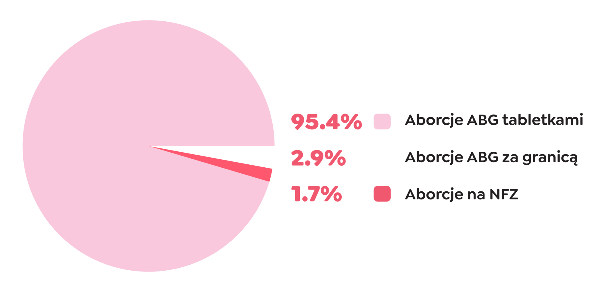

# Raport Aborcji Bez Granic - Rzeczywistość aborcyjna 2024

Aborcja w Polsce jest codzienną rzeczywistością, mimo restrykcyjnego prawa. 

Szacuje się, że w Polsce co roku wykonywanych jest od 120 do 150 tysięcy aborcji. Niniejszy raport przedstawia działalność Aborcji Bez Granic (ABG) w 2024 roku, czyli inicjatywy zrzeszającej dziewięć organizacji, które od 2019 roku wspólnie pomagają osobom potrzebującym przerwać ciążę.

W tym raporcie przedstawiamy dane dotyczące aborcji przeprowadzanych ze wsparciem ABG oraz analizujemy szerszy kontekst społeczny i medyczny, w którym funkcjonują osoby decydujące się na aborcję w Polsce.

<!-- more -->

Niniejszy raport jest również dostępny do pobrania jako [.pdf w kolorze](./../../assets/pdf/raport_ABG_2024_kolor.pdf) oraz [czarno-biały .pdf do druku](./../../assets/pdf/raport_ABG_2024_druk.pdf). For ENG press [.pdf](./../../assets/pdf/raport_ABG_2024_ENG.pdf). :)

## Dane statystyczne za 2024 rok

**Podsumowanie roczne**

* Liczba aborcji ze wsparciem ABG: 47 000
  * Tabletki aborcyjne w pierwszym trymestrze: 44 500
  * Tabletki w drugim trymestrze: 1 350
  * Wyjazdy w drugim trymestrze: 1 130
  * Wyjazdy w trzecim trymestrze: 17
  * Anonimowe adopcje: 10
* Łączna liczba wyjazdów za granicę: 1 147

**Kto robi ile aborcji w Polsce? Aborcja Bez Granic vs Polskie szpitale**

Zestawienie zabiegów ze wsparciem ABG do tych z NFZ (nie wliczając conajmniej 100 tys. Aborcji, o których nie mamy dokładnych danych).

{ style="background-color:#FDEAF2;" }

**Kierunki wyjazdów**

* Pierwszy trymestr: Niemcy, Czechy, Austria
* Drugi trymestr: Holandia, Belgia, Francja, Austria, Czechy, Anglia, Niemcy, Czechy
* Trzeci trymestr: Belgia, Francja, Meksyk, Anglia

**Finanse**

* Kwota przeznaczona na pomoc w aborcjach: 2 069 995,10 PLN
* Koszt tabletki aborcyjnej (darowizna): 75 EUR

**Kontakt**

* Liczba maili do Women Help Women (WHW): Ponad 100 000
* Telefoniczne wsparcie w aborcji: Ponad 6000 rozmów
* Najmłodsza osoba, której pomogłyśmy: 12 lat
* Najpóźniej przerwana ciąża: 36 tygodni

## Aborcja w Polsce z Aborcją Bez Granic

### Najpopularniejsza metoda: Tabletki aborcyjne

Najczęstszą metodą przerywania ciąży są tabletki aborcyjne, które stanowią 99% wszystkich aborcji w Polsce. Każdego dnia 130 osób korzysta z tabletek ze wsparciem ABG.

Tabletki aborcyjne zawierają mifepriston i misoprostol, przy czym w Polsce na receptę dostępny jest tylko misoprostol. 

Bezpieczne zestawy aborcyjne można zamawiać z serwisu Women Help Women ([womenhelp.org](https://womenhelp.org)). Proces ten jest dyskretny, a paczka przychodzi w ciągu 10 dni.

### Pomoc w domowej aborcji

Każdego dnia ABG:

* Udziela szczegółowych instrukcji dotyczących dawkowania.
* Odpowiada na pytania telefonicznie, mailowo oraz przez social media.

### Zagrożenia związane z nierzetelnymi źródłami

Nie wszystkie tabletki aborcyjne zamawiane są z bezpiecznych źródeł. Na restrykcyjnym prawie zarabiają [oszuści](./../czarna-lista/poradnik.md) i handlarze:

*	Sprzedają leki po wygórowanych cenach lub wysyłają placebo.
*	Pozorują działalność feministycznych organizacji pomocowych.

Wybierając bezpieczne serwisy jak WHW, osoby unikają ryzyka, w tym problemów prawnych w razie zatrzymania handlarza przez policję (przerywanie ciąży nie jest przestępstwem w Polsce).

## Aborcja w polskich szpitalach

### Dane z systemu ochrony zdrowia

W 2024 roku w polskich szpitalach wykonano 787 zabiegów przerwania ciąży (stan na październik). Jest to mniej niż 0,5% wszystkich aborcji w Polsce.

### Jakość opieki w polskich szpitalach

Polskie szpitale nadal stosują przestarzałe i traumatyzujące metody:

*	Łyżeczkowanie (niewskazane przez WHO).
*	Indukcja poronienia trwająca nawet ponad dobę.
*	W skrajnych przypadkach – cesarskie cięcie.

Osoby w zaawansowanych ciążach są często zaskakiwane formą zabiegu i niskim poziomem opieki. 

Polscy lekarze mają problem z udzielaniem pomocy, nawet gdy prawo na to zezwala, co wynika z braku doświadczenia i obaw przed konsekwencjami prawnymi.

### Cytaty pacjentek

Przykładowe opinie wyrażane przez osoby starające się o aborcję w Polskich szpitalach:

!!! quote ""
    „Po badaniu USG lekarka powiedziała: ‘Serce bije, nic nie możemy zrobić.’”

!!! quote ""
    „Byłam pewna, że to będzie zabieg, nie byłam przygotowana na to, że będę musiała rodzić martwe dziecko.”

## Aborcja za granicą

### Liczba wyjazdów

Każdego dnia 7 osób wyjeżdża za granicę dzięki pomocy sieci Aborcji Bez Granic, by przeprowadzić aborcję w warunkach, które zapewniają godność i minimalizują traumę.

### Popularne kierunki

*	Drugi trymestr: Holandia, Belgia, Francja, Anglia.
*	Trzeci trymestr: Belgia, Francja, Anglia a nawet MEKSYK!

### Inicjatywy wspierające pacjentki

W Holandii powstał symboliczny cmentarz niedaleko kliniki, gdzie osoby w żałobie mogą pożegnać swoje ciąże.

Kierowniczka dwóch holenderskich klinik, Femke van Straaten, podkreśla:

  Polskie pacjentki często odczuwają zarówno żałobę, jak i ulgę po zabiegu.

## Finansowanie aborcji

### Koszty pokrywane przez ABG

W 2024 roku sieć ABG po raz pierwszy przekroczyła wydatki na poziomie 2 milionów złotych.

Coraz więcej osób, które kontaktują się z organizacjami pomagającymi w aborcji, potrzebuje zniesienia kwoty darowizny na tabletki aborcyjne. 

Wzrastające koszty życia sprawiają, że wiele osób prosi organizacje o pełne finansowanie zabiegu.

### Dług aborcyjny w Polsce

W 2024 roku organizacje zrzeszone w ABG opublikowały informację [o długu aborcyjnym wynoszącym 50 milionów złotych](./../organizacje/aborcyjny-dlug-polski.md), wynikającym z 18-letniego wsparcia osób potrzebujących aborcji w Polsce.

## Przychodnia ABOTAK

Obiecano nam legalną aborcję, ale obietnic wciąż nie spełniono. Dlatego już nie czekamy i otwieramy pierwszą przychodnię aborcyjną w Polsce - AboTak. 

Chcemy wywrzeć presję na politykach i ochronie zdrowia, by w końcu doczekać się obiecanych zmian. Przychodnia AboTak to kolejny krok do legalizacji aborcji w Polsce, oraz dowód na to, że epoka zawstydzania aborcją bezpowrotnie się skończyła. 

Przychodnia Aborcyjna Abotak to więcej niż miejsce wsparcia – to przestrzeń w której, ją rzeczywiście zapewniamy. Chcemy, by dostęp do bezpiecznej aborcji w końcu stał się w Polsce rzeczywistością. To nasz sygnał do polityków i systemu ochrony zdrowia: nie będziemy dłużej godzić się na chaos obecnej sytuacji. 

Przychodnia AboTak to także dowód na to, że epoka zawstydzania aborcją dobiegła końca. Tutaj każda osoba potrzebująca pomocy znajdzie zrozumienie i profesjonalną opiekę. Już za chwilę w centrum Warszawy.

Więcej o Przychodni na: [abotak.org](https://abotak.org)

## O sieci Aborcja Bez Granic

Aborcja Bez Granic to sieć 9 organizacji, które wspólnie pracują nad zapewnieniem dostępu do aborcji, niezależnie od sytuacji prawnej. 

W 2024 roku Aborcja Bez Granic przeszkoliła 4 nowe, niezależne od siebie grupy, które w minionym roku zaczęły pomagać w aborcjach.

### Wierzymy w:

* Pomoc: Dostarczamy informacji i wsparcia osobom potrzebującym aborcji.
* Destygmatyzację: Walczymy ze stygmatyzacją aborcji, zarówno farmakologicznej, jak i przeprowadzanej w klinice za granicą.
* Bezwarunkowe wsparcie: Oferujemy empatię i zrozumienie, bez zadawania pytań.
* Autonomię: Uznajemy prawo każdej osoby do samodzielnego podejmowania decyzji.
* Solidarność: Chcemy, by dostęp do aborcji był możliwy dla wszystkich, niezależnie od sytuacji finansowej.

### W skład sieci wchodzą: 

Kobiety w sieci, Women Help Women, Ciocia Basia, Ciocia Czesia, Ciocia Wienia, Abortion Network Amsterdam, Abortion Support Network, Supporting Abortions for Everyone – SAFE, Aborcyjny Dream Team.

## Podsumowanie

Aborcja w Polsce dzieje się codziennie, głównie dzięki niewidocznej pracy aktywistek, organizacji pomocowych i międzynarodowej solidarności. 

Państwo polskie systematycznie unika odpowiedzialności za zdrowie i życie kobiet, pozostawiając ten ciężar na barkach prywatnych darczyńców i organizacji takich jak Aborcja Bez Granic.

Raport pokazuje, że mimo restrykcyjnego prawa osoby w Polsce mają dostęp do bezpiecznej aborcji – w domu lub za granicą – dzięki wsparciu sieci i grup feministycznych. 

W obliczu wyzwań finansowych i społecznych ABG pozostaje ostoją dla tysięcy osób każdego roku.

---

**ABORCJE:**
Rząd *obiecuje*.
My *robimy*.