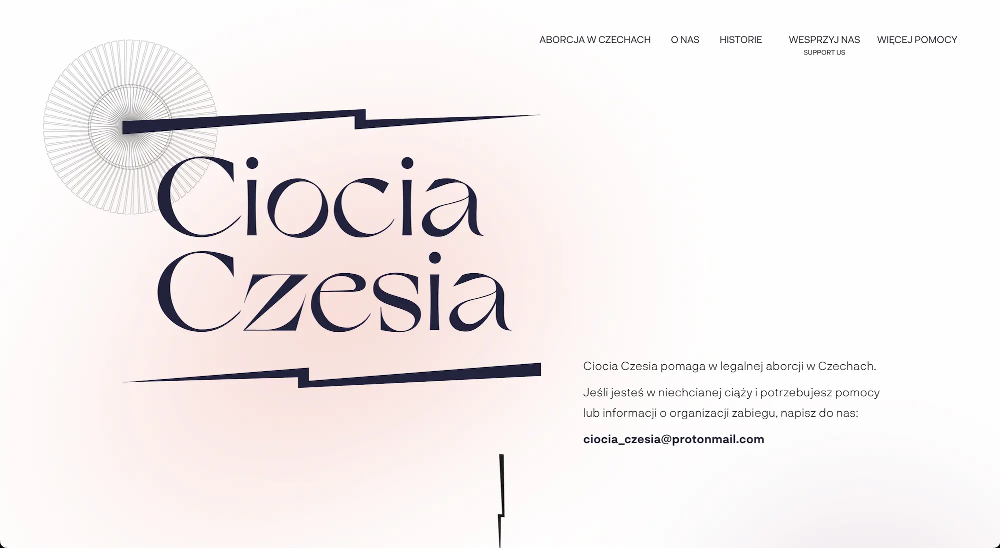

# Oszuści podszywają się pod Ciocię Czesię - jak rozpoznać prawdziwą organizację

Ważne info od grupy pomagającej Polkom (i nie tylko) w aborcji w Czechach - Ciocia Czesia:

> powstała fałszywa strona podszywająca się pod naszą - prawdziwą (ciociaczesia.pl)

<!-- more -->

## Prawdziwy adres to ciociaczesia.pl

Oficjalny i jedyny adres strony www Cioci Czesi to [ciociaczesia.pl](https://ciociaczesia.pl). Kolektyw udziela wsparcia poprzez adres mail: [ciocia_czesia@protonmail.com](mailto:ciocia_czesia@protonmail.com).

Prawdziwą strona Cioci Czesi wygląda następująco: 

Jednak jej wygląd może się z czasem zmienić i to poprawny adres URL - *ciociaczesia.pl* - jest najważniejszy i świadczy o autentyczności strony.

Więcej o grupie i jej akcjach dowiecie się na profilu: [facebook.com/kolektyw.ciociaczesia/](https://www.facebook.com/kolektyw.ciociaczesia/).

## ciocia-czesia.cz to fejk

Strona ciocia-czesia.cz **nie** jest stworzona przez kolektyw Ciocia Czesia i nie ma z nim nic wspólnego. Informacje na niej zawarte nie są przez nią weryfikowane.

## Czemu ktoś podszywa się pod stronę Cioci Czesi?

Możliwe, że gdy fałszywa strona zyska wystarczającą popularność, to oszuści umieszczą przekierowanie do jednego ze swoich "sklepów z tabletkami poronnymi" lub, jeśli to inicjatywa przeciwników aborcji, treści wprowadzające w błąd. O ile nie mamy nic przeciwko uczciwym sprzedawcom leków aborcyjnych, to taktyka podszywania się pod [organizacje udzielające bezpłatnej pomocy](../../../alternatywy.md) znana jest nam niestety ze strony **oszustów** stojących za *poronne.org* czy ostatnio *aborcja-legalnie.pl*.
