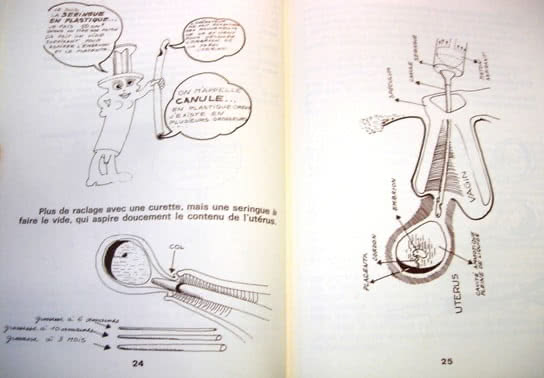
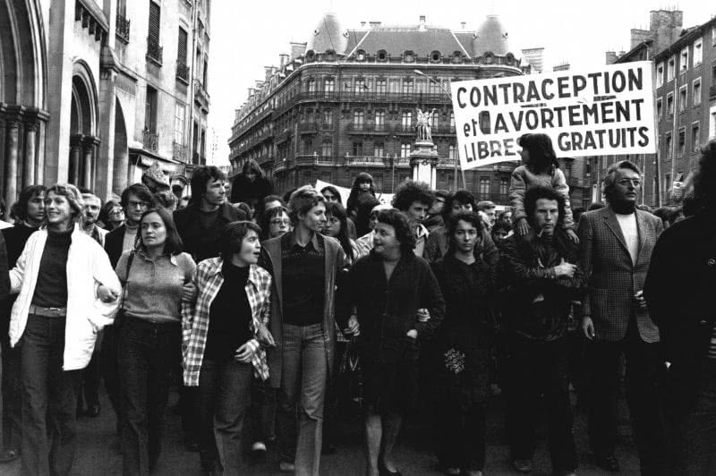

# Rocznica francuskiego „Manifestu 343″ - historia aborcji { id="francja-manifest-343" }
5 kwietnia 1971 roku na łamach francuskiego pisma „Le Nouvel Observateur” ukazał się tak zwany „Manifest 343”. Podpisały się pod nim 343 kobiety, deklarując że nielegalnie przerwały ciąże.

<!-- more -->

Publikacja manifestu jest jednym z najbardziej znanych aktów nieposłuszeństwa obywatelskiego. W tym czasie we Francji za aborcję groziła kara więzienia. **Tekst, zredagowany przez filozofkę Simone de Beauvoir i podpisany przez ponad trzysta rozpoznawalnych kobiet, w tym Collette Audry, Catherine Deneuve czy Dominique Desanti, wywołał ogromne poruszenie.** Bywa określany jako manifest 343 „suk” lub „dziwek”. “Manifest 343” niewątpliwie przyczynił się jednak do rozpoczęcia dyskusji na temat prawa aborcyjnego we Francji. W 1975 roku obowiązujące prawo znacząco zliberalizowano. Przyjęta tak zwana „ustawa Veil” (od nazwiska ministry zdrowia, Simone Veil) dopuszczała przerywanie ciąży w ciągu pierwszych 10 tygodni.

<iframe style="border-radius:12px" src="https://open.spotify.com/embed/episode/4dPYLNqgk5KmMu77sq5SQr?utm_source=generator&theme=0" width="100%" height="152" frameBorder="0" allowfullscreen="" allow="autoplay; clipboard-write; encrypted-media; fullscreen; picture-in-picture" loading="lazy"></iframe>

Odcinek podcastu „Coś na A” poświęcony m.in. Marie Claire oraz ministrze Simone Veil (która, jak się przekonacie, odgrywa w ruchu aborcyjnym o wiele mroczniejszą rolę, niż ta z której została zapamiętana).

## Historia zmiany prawa aborcyjnego we Francji { id="zmiana-prawa-aborcyjnego" }

Cała historia zmian aborcyjnych we Francji jest jednak o wiele bogatsza, **bo pomiędzy manifestem a ustawą wydarzyło się coś bardzo ważnego, o czym chcemy dziś przypomnieć.** Liberalizacja aborcji we Francji to nie tylko Simone Veil, podobnie jak aborcja to nie tylko polityka.

Kilkanaście miesięcy po „manifeście 343 dziwek”, czyli grupowym aborcyjnym coming oucie, którego we francuskich mediach dokonała grupa kilkuset kobiet, metoda Harveya Karmana dotarła do Francji. Pierwsza demonstracja aborcji „metodą Karmana” miała miejsce w mieszkaniu feministycznej działaczki Delphine Seyrig w sierpniu 1972 r. **Harvey Karman, psycholog i działacz na rzecz wolności aborcji w Kalifornii od lat 50. XX wieku, był promotorem odkrytej w Chinach nowej metody przeprowadzania aborcji w pierwszych tygodniach ciąży.** Polegała ona na zasysaniu zawartości macicy za pomocą kaniuli i strzykawki.

W przeciwieństwie do łyżeczkowania, które zwykle stosowało się do aborcji, metody Karmana można stosunkowo łatwo nauczyć. **Zabieg był tak nieinwazyjny, że znieczulenie chemiczne zostało zastąpione „znieczuleniem werbalnym”, co oznacza ciągły dialog osoby przerywającej własną ciążę z jednym lub kilkoma pomocnikami, którzy emocjonalnie towarzyszą w tym procesie.**

{ align=right loaing=lazy }

Odkrycie tej metody przez francuskie działaczki i działaczy w 1972 r. stanowiło punkt zwrotny w walce o bezpłatną aborcję: przede wszystkim zapoczątkowało nową strategię polityczną, którą była praktyka aborcji. **Powstał Ruch na Rzecz Wolności Aborcji i Antykoncepcji (MLAC),** zrzeszający działaczki feministyczne, lekarzy, lekarki, związkowczynie i związkowców czy członkinie ruchu robotniczego, studenckiego i partii komunistycznej.

### MLAC i praktykowanie aborcji jako obywatelskie nieposłuszeństwo { id="mlac-jako-opor" }

Głównym celem ruchu MLAC była praktyka aborcji rozumiana jako forma obywatelskiego nieposłuszeństwa i **oporu wobec prawa uznanego za niesprawiedliwe.**

Odkrycie metody Karmana umożliwiło **niezwykły sojusz i niespotykaną współpracę dwóch ruchów na rzecz bezpłatnej aborcji: nieposłusznych lekarzy i działaczek feministycznych.** Prostota metody Karmana umożliwiała symboliczne odzyskiwanie władzy kobiet nad ich własnymi ciałami – rurka może być włożona samodzielnie przy pomocy lustra, a rola lekarza\_lekarki sprowadza się do instruktażu i asysty. Granica między specjalistami, a niespecjalistami zatarła się dzięki chęci [demedykalizacji aborcji](../organizacje/kinga-jelinska-na-zjezdzie-fiapac-specjalistow-aborcyjnych-w-rydze.md).

MLAC poszerzył działalność o organizowanie wyjazdów aborcyjnych z Paryża do Anglii i Holandii. **Prawo było otwarcie lekceważone, a nielegalność stała się uzasadniona, publiczna i polityczna.**

Aborcje metodą Karmana miały miejsce częściej w mieszkaniach sympatyków i sympatyczek ruchu lub u kobiet, które skorzystały ze wsparcia MLAC. W ruchu chodziło o coś więcej niż tylko praktykę aborcji i bezpośrednią pomoc. **Osoba korzystająca ze wsparcia musiała zdać sobie sprawę, że jej przypadek nie jest wyjątkowy, że jest jedną z wielu osób i dlatego musi także zaangażować się w tę walkę.** W jednej z ulotek MLAC rozpowszechnionej w Paryżu możemy przeczytać:

> Czy aborcja jest tylko indywidualnym problemem? Zdecydowałaś się na aborcję, to nie przyjemność. Myślisz, że to „twój” problem i w pewnym sensie masz rację. Ale czy indywidualny problem, który każdego dnia jest problemem 2 tysięcy innych kobiet, nie staje się problemem zbiorowym? Tak nam się wydaje, dlatego tu jesteśmy. \[…\]. Nie jesteśmy jednak tylko usługą socjalną. Od ponad roku walczymy poza prawem i prosimy o dołączenie się do tej walki.
> 
> apelował MLAC

Do ruchu na rzecz wolności aborcji dołączały młode lekarki i lekarze, sprzeciwiając się dominacji starszych kolegów z oddziałów szpitalnych, związkowczynie i związkowcy oraz członkinie ruchu robotniczego i partii komunistycznej. **Wszystko działo się w tym samym czasie, gdy pięć kobiet zostało skazanych za pomoc w aborcji** córce jednej z nich – był to tak zwany proces Bobigny.

### 331 lekarzy i lekarek dołączyło do protestu deklarując pomoc w aborcji za darmo { id="protest-medykow" }

**5 lutego 1973 r. „Le Nouvel Observateur” opublikował manifest 331 lekarzy i lekarek, którzy zadeklarowali praktykę aborcji lub pomoc w jej wykonywaniu za darmo.**

Manifest środowiska medycznego był jednocześnie **apelem o dostęp do darmowej aborcji zwłaszcza dla osób nieletnich,** dostęp do darmowej antykoncepcji i dostęp do bezpłatnej aborcji, która miała być refundowana przez ubezpieczenie społeczne. Manifest nieposłusznych lekarzy i lekarek wyraźnie podkreślał, że **decyzja o aborcji ma należeć wyłącznie do kobiety.** 

MLAC zaczął dzielić się na lokalne grupy, by móc prowadzić działalność we własnych regionach. 13 września 1973 roku na konferencji prasowej MLAC działający w regionie Rodan-Alpy poinformował, że przeprowadził 2500 aborcji.

{ loading=lazy }

Manifestation en faveur de l’avortement

W tamtym czasie **w stowarzyszeniu działało już 15 000 zarejestrowanych członkiń i członków.** Zarejestrowane członkostwo oznaczało udział w praktyce aborcji. Pojawiły się też pierwsze statystyki dotyczące kobiet korzystających z usług MLAC: **większość kobiet pochodziło ze środowisk mniej uprzywilejowanych, najliczniejsze to zamężne kobiety (35%);** osoby niepełnoletnie (poniżej 21 lat) stanowiły tylko 11%. **Jedna na cztery kobiety miała dwoje dzieci i nie chciała trzeciego.**

### Koniec mitu – fotoreportaż z przeprowadzenia aborcji w gazecie { id="magazyn-marie-claire" }

**W 1974 roku magazyn „Marie Claire”** opublikował obszerny reportaż na temat „praktyki aborcji”, a do tekstu dołączył **zdjęcia wykonane podczas aborcji wykonanej samodzielnie w jednym z paryskich mieszkań** – wszak prywatne jest polityczne! Francuskie feministki ogłosiły „realne odzyskanie ciał”. 

### Simone Vail – ministra będąca przeciwniczką aborcji zmuszona do jej zalegalizowania { id="simone-vail" }

W 1975 roku Francja zliberalizowała antyaborcyjne prawo, zaraz po tym, jak Simone Veil wygłosiła swoje słynne przemówienie i sprzeciwiła się poniekąd „praktyce aborcyjnej” nazywając ją anarchią:

> Jeśli lekarze w swoich gabinetach nie przestrzegają prawa i mówią o tym publicznie, \[…\] jeśli ośrodki pomocy instytucji publicznych muszą udzielać zrozpaczonym kobietom informacji ułatwiających dostęp do aborcji, jeśli organizuje się prawie jawnie, czasami wyczarterowanymi samolotami, turystykę aborcyjną, to moim zdaniem jesteśmy w sytuacji nierządu i anarchii, której nie możemy tolerować.
> 
> rozpaczała z mównicy Simone Vail

Nie można odmówić oddania Simone Veil w walkę o równość płci, ale też **warto pamiętać, że francuska ministra podchodziła do aborcji jako do czegoś niepożądanego,** co musi być kontrolowane, zwłaszcza przez państwo. Jej zdaniem aborcja powinna wrócić w ręce specjalistów i do szpitali. Liberalizacja aborcji w 1975 roku miała ogromny wpływ na dalsze działanie MLAC, który uległ podziałom. Główna oś podziału dotyczyła oceny nowego prawa.

### „Legalizacja” Simone Vail okazała się cenzurą i katastrofą dla aborcyjnej praktyki { id="simone-vail-cd" }

Część działaczy i działaczek MLAC oceniało reformę jako katastrofę, aborcja była przecież częściowo dekryminalizowana. **Brak entuzjazmu wynikał również z faktu, że sam termin “aborcja” był zakazany i miał być zastąpiony określeniem “dobrowolne przerywanie ciąży”.** 

Historia ta pokazuje, że choć aborcja jest kwestią polityczną, to **rzeczywistość aborcyjna dzieje się z dala od miejsc, w których podejmowane są najważniejsze decyzje jej dotyczące** – ma miejsce w domu, a nie parlamencie. MLAC był tej rzeczywistości o wiele bliżej niż Simone Veil i inne osoby, które miały decydujący wpływ na to, jak będzie wyglądało nowe prawo.

## Czy historia aborcyjnych błędów się powtórzy? { id="czy historia-sie-powtorzy" }

Warto pamiętać tę historię także dziś, kiedy reformie ulega prawo aborcyjne w wielu krajach. **Skupienie na lekarzach, szpitalach i formalnym systemie ochrony zdrowia może być zupełnie nieadekwatne do potrzeb osób, które aborcji potrzebują.** Co więcej – bezpieczne i skuteczne metody przerywania ciąży mogą zostać przez to prawo zapomniane lub celowo pominięte i przez to kryminalizowane. Tak na przykład [zadziało się w Irlandii](../historia/referendum-aborcyjne-3-lata-po-gdzie-jest-dostep-do-aborcji-w-irlandii.md) – wraz ze zmianą prawa po referendum odrzucającym zakaz aborcji z konstytucji aborcja farmakologiczna może odbywać się tylko w kontakcie z formalną służbą zdrowia. **Coś, co do tej pory było dla wielu osób sposobem na przerwanie ciąży – czyli zażycie zakupionych przez internet tabletek aborcyjnych w domu – stało się nielegalne.**

Historia MLAC i reformy prawa we Francji pokazuje, że **prawo aborcyjne jest tworzone w sposób oderwany od rzeczywistości aborcyjnej i sytuacji osób, które jej potrzebują.** Najczęściej to nie dla nich tworzone są przepisy, a przeciwko nim.

Źródła:

[Michelle Zancarini-Fournel Histoire(s) du MLAC (1973-1975)](https://journals.openedition.org/clio/624)

[Bibia Pavard: «Simone Veil a tiré ses convictions sur l’égalité de son parcours](https://www.liberation.fr/debats/2017/07/04/bibia-pavard-simone-veil-a-tire-ses-convictions-sur-l-egalite-de-son-parcours_1581536?fbclid=IwAR2GskCdYnPkk18HciWoyOgNrkFhDQzxZ_Yp8pj9sPPhkMakdWjWRvKv4wY)

[Bibia Pavard Genre et militantisme dans le Mouvement pour la liberté de l’avortement et de la contraception. Pratique des avortements (1973-1979)](https://journals.openedition.org/clio/9217)

[„Manifest 343 dziwek”, które mają odwagę powiedzieć „ja też przerwałam ciążę”.](http://codziennikfeministyczny.pl/manifest-343-dziwek-ktore-maja-odwage/)