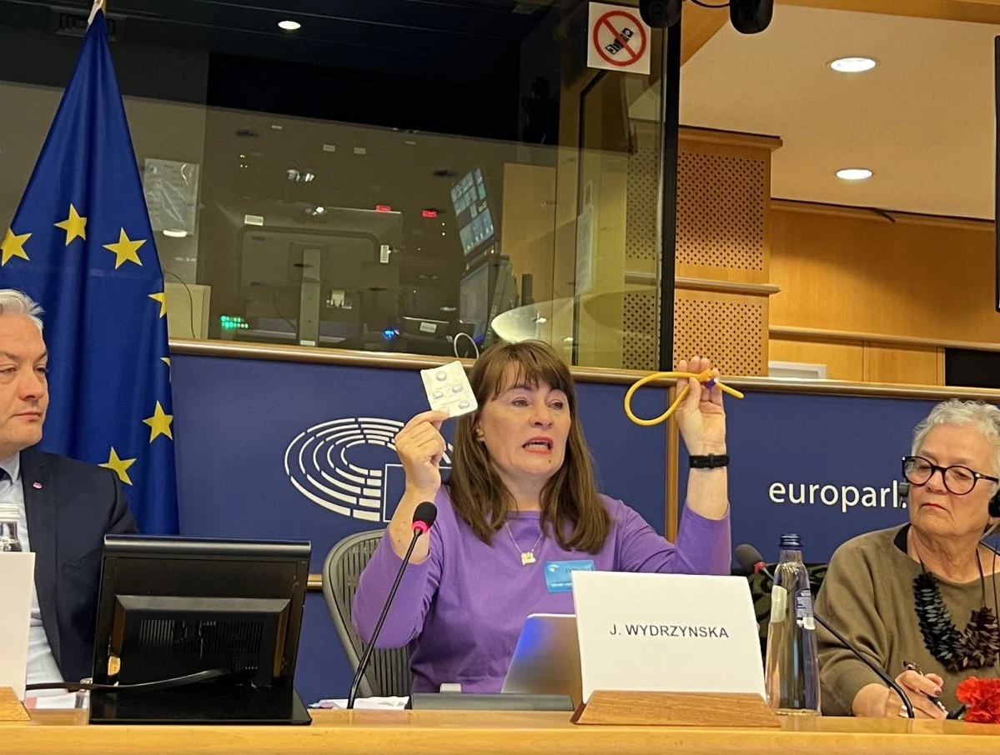

# Justyna Wydrzyńska złożyła wyjaśnienia przed komisją Parlementu Europejskiego

Za pomoc innej kobiecie Justyna Wydrzyńska została nieprawomocnie skazana na osiem miesięcy ograniczenia wolności. Dzisiaj wysłuchała ją komisja praw kobiet Parlamentu Europejskiego.

<!-- more -->

## Komisja wzywa do walki z push-backiem przeciwko prawom kobiet w Uni i na świecie

Justyna Wydrzyńska mówiła o rozprawie przed upolitycznionym przez Ziobrę sądem, pomocy w aborcji, o polskich lekarzach, którzy przyczyniają się do śmierci kobiet i o tym co może zrobić PE by wesprzeć Polki.

> Obecnie kobiety w Polsce mają mniej praw niż w 2004 roku gdy wstępowały do Unii Europejskiej. [...] Musimy zatrzymać karanie kobiet w Polsce za okazywanie sobie pomocy i solidarności. 
> - mówił Rober Biedroń - przewodniczący komisji

Justyna wprowadziła komisję PE w obecny stan rzeczywistości aborcyjnej i klimacie w którym działają aborcyjne działaczki.

> Po śmierci Izabeli z Pszczyny strach bardzo wzrósł nie tylko u pacjentek ale też u nas. Gdy dowiadujemy się o kolejnej kobiecie w sytuacji podobnej do Izabeli, to zastanawiamy się: “Czy uda nam się pomóc jej na czas? Czy by ocalić jej życie nie warto doradzić jej wypisanie się ze szpitala? Czy odpowiedzialne i bezpieczne będzie wsadzenie jej do samolotu? Czy może trzeba ponieść osobiste ryzyko odpowiedzialności  karnej i zdecydować się dla niej o wysłaniu tabletek aborcyjnych do szpitala?” By uratować jej życie i zatrzymać tę bezradność polskich ginekologów.

Swój wyrok, który otrzymała parę tygodni temu skomentowała słowami:

> Dosyć paradoksalne jest usłyszeć te słowa od sędzi nominowanej przez prokuratora generalnego. Zostałam skazana na 8 miesięcy ograniczenia wolności poprzez wykonywanie 30 godzin miesięcznie darmowych i kontrolowanych prac społecznych. Następnego dnia po wyroku media poinformowały, że moja sędzia w dniu ogłaszania wyroku dostała awans do sądu apelacyjnego. Nabrałam pewności, że w starciu z polskim systemem nie miałam żadnych szans na sprawiedliwość. Zresztą nie tylko ja, ale Ania - kobieta której wysłałam tabletki też nie tej szansy nie miała.

Justyna opowiedziała PE [o historii Ani, której próbowała pomóc przerwać niechcianą ciążę](https://oko.press/wywiad-z-anna-ktorej-wydrzynska-wyslala-tabletki):

> Tydzień temu, Ania udzieliła wywiadu Magdalenie Chrzczonowicz dla polskiego portalu Oko Press i opowiedziała swoją część historii. To opowieść o samotności, traumie bycia w niechcianej ciąży, uporczywych dolegliwościach jakimi są niepowściągliwe wymioty w ciąży. To jest też historia o przemocy systemowej, ignorancji personelu medycznego, okrucieństwie polskiej ustawy antyaborcyjnej i bardzo wąskiej jej interpretacji, o ucieczce ze szpitala by móc się ratować.

Justyna nie wycofywała się z tego jakiej pomocy udzieliła Ani. Mówiła o bezpiecznym i rekomendowanym przez WHO zestawie tabletek aborcyjnych, które jej wysłała.

Moment ten był dla Justyny Bardzo poruszający, a informację o zestawie aborcyjnym przekazywała politykom przez łzy.

> Bezpieczny zestaw do aborcji farmakologicznej, rekomendowany przez Światową Organizację Zdrowia. Tymi lekami można przerwać ciąże samodzielnie bez konieczności kontaktu z personelem medycznym. Skutki uboczne są krótkotrwałe a skuteczność wynosi 98%. Ania miała szansę na bezpieczną aborcję, ale ta szansa została jej odebrana.

W tym momencie Justyna na moment przerwała: przepraszam państwa bardzo, to bardzo poruszająca mnie sprawa.

> W konsekwencji Ania musiała sięgnąć po metodę naszych prababek czyli cewnik i doprowadzić się do sepsy, by otrzymać ratunek. Na szczęście przeżyła, ale musimy to powiedzieć wprost: wymknęła się śmierci, mogła być następną Izą z Pszczyny albo Agnieszką z Częstochowy. Uratowało ją to, że w porę trafiła do szpitala i lekarze dostrzegli zagrożenie życia.
>
> Ani ja, ani Ania nie zaznały sprawiedliwości w sądzie.

Swoje wystąpienie Justyna zakończyła zwrotem do polityków i polityczek:

> Potrzebujemy więcej takich inicjatyw jak ta ministry równości w Belgii Sara Schlitz czy rządu francuskiego. To jest realne wsparcie i osoby w ciążach z wadami w drugim czy trzecim trymestrze mogą mieć bezpieczne aborcji w Holandii, Belgii czy Francji. To właśnie te zabiegi są najdroższe. Co jeszcze możecie zrobić? Polska musi zmienić prawo aborcyjne łagodniejsze i przestać karać za pomocnic w aborcji a do tego potrzebna jest wasza presja. Nie bójcie się wywierać tej presji.
>
> Możecie uratować komuś życie.

Po wystąpieniu Justyny Rober Biedroń podsumował: *na tej komisji wysłuchaliśmy wielu przemówień, ale to było jednym z bardziej poruszających i przejmujących. Justyno, jesteś bohaterką i bardzo dziękujemy ci za to.*

Kolejną prelegentką była Elżbieta Korolczuk, która mówiła o tym jak kampanie przeciwko równości kobiet i płci skupiają się obecnie na problemie genderu. Tłumaczyła w jaki sposób konserwatywna i prawicowa krytyka genderu służy demagogom w Europie do demontowania demokracji.

## Całość wystąpienia Justyny

> Dzień dobry, dziękuję za zaproszenie na to wydarzenie.
>
> Nazywam się Justyna Wydrzyńska i od 16 lat pomagam w aborcjach w Polsce. Ponad miesiąc temu, dokładnie 14 marca zostałam uznana przez polski sąd za winną udzielenia pomocy w aborcji.
>
> Na co dzień jestem jedną z osób, która odbiera telefon infolinii Aborcja Bez Granic, działający od grudnia 2019 roku. Codziennie od 8.00 do 20.00 można zadzwonić na numer 22 29 22 597 i uzyskać wsparcie przed, w trakcie i po aborcji tabletkami w domu. robią aborcję z nami aborcję. Codziennie.
>
> Podpowiadamy skąd zamówić bezpieczne tabletki, jak się przygotować do aborcji farmakologicznej, co się będzie działo w trakcie. Udzielamy bardzo praktycznych informacji, bo aborcja to jest kwestia bardzo praktyczna.
> 
> Od wyroku TK Aborcja Bez Granic pomogła ponad 100 tysiącom osób z Polski w dostępie do bezpiecznej aborcji. To średnio 107 aborcji każdego dnia.
>
> W ramach Aborcji Bez Granic pomagamy też zorganizować aborcję w zagranicznej klinice, opłacić zabieg, wyjazd i pobyt. Od wyroku TK ponad 2 tysiące osób pojechało z nami na zabieg aborcji chirurgicznej do zagranicznej kliniki i przeznaczyłyśmy na to ponad 2 miliony polskich złotych.
> 
> Kobiety wyjeżdżają z Polski do Holandii, Belgii, Anglii, Francji, Niemiec, Czech czy Austrii i wracają wręcz zaskoczone tym, jak po ludzku zostały potraktowane.
> 
> Wiele z nich próbowały wcześniej “załatwić” aborcję w polskim szpitalu ale się poddały. Nie były w stanie wytrzymać już ani jednego dnia dłużej niepewności “czy się Uda załatwić?”, protekcjonalności polskich lekarzy, odsyłania od szpitala do szpitala, klauzuli sumienia czy zwyczajnej gry na czas przeciwko nim.
> 
> Od wyroku coraz częściej odbieramy telefony od osób, które już leżą w polskich szpitalach. Mają poczucie, że dla polskiego lekarza ważniejsza od ich zdrowia i ich życia, jest zagrożona czy nierokująca ciąża z wadami płodu (a może ich własne bezpieczeństwo prawne).
> 
> Po śmierci Izabeli z Pszczyny strach bardzo wzrósł nie tylko u pacjentek ale też u nas. Gdy dowiadujemy się o kolejnej kobiecie w sytuacji podobnej do Izabeli, to zastanawiamy się: “Czy uda nam się pomóc jej na czas? Czy by ocalić jej życie nie warto doradzić jej wypisanie się ze szpitala? Czy odpowiedzialne i bezpieczne będzie wsadzenie jej do samolotu? Czy może trzeba ponieść osobiste ryzyko odpowiedzialności karnej i zdecydować się dla niej o wysłaniu tabletek aborcyjnych do szpitala?” By uratować jej życie i zatrzymać tę bezradność polskich ginekologów.
> 
> Na początku 2020 roku odezwała się do Aborcji Bez Granic Ania, która była w 12 tygodniu ciąży. Przez telefon podkreślała, że jej partner kontroluje jej skrzynkę e-mail i telefon. Pisała w mailach, że sobie coś zrobi jeśli nie uda się jej przerwać ciąży. Wysłałam jej tabletki, ale Ania nigdy ich nie użyła, bo jej partner powiadomił policję, a ta zabrała tabletki i przesłuchała Anię. Tak rozpoczęła się moja sprawa.
> 
> Miesiąc temu usłyszałam wyrok skazujący i a sędzia która orzekała w mojej sprawie, w trakcie uzasadnienia wyroku powoływała się na praworządność, podkreślała, że każdy obywatel musi szanować prawo. Dosyć paradoksalne jest usłyszeć te słowa od sędzi nominowanej przez prokuratora generalnego. Zostałam skazana na 8 miesięcy ograniczenia wolności poprzez wykonywanie 30 godzin miesięcznie darmowych i kontrolowanych prac społecznych. Następnego dnia po wyroku media poinformowały, że moja sędzia w dniu ogłaszania wyroku dostała awans do sądu apelacyjnego. Nabrałam pewności, że w starciu z polskim systemem nie miałam żadnych szans na sprawiedliwość. Zresztą nie tylko ja, ale Ania - kobieta której wysłałam tabletki też nie tej szansy nie miała.
> 
> Tydzień temu, Ania udzieliła wywiadu Magdalenie Chrzczonowicz dla polskiego portalu Oko Press i opowiedziała swoją część historii. To opowieść o samotności, traumie bycia w niechcianej ciąży, uporczywych dolegliwościach jakimi są niepowściągliwe wymioty w ciąży. To jest też historia o przemocy systemowej, ignorancji personelu medycznego, okrucieństwie polskiej ustawy antyaborcyjnej i bardzo wąskiej jej interpretacji, o ucieczce ze szpitala by móc się ratować. 
> 
> Zanim Ania zwróciła się do nas po pomoc, była w polskim szpitalu. Spędziła tam ponad tydzień wbrew swojej woli. Była odwodniona i niedożywiona, bo wcześniej nie jadła nic przez 3 tygodnie. Cały czas wymiotowała, po kilkanaście razy dziennie. Lekarzom w szpitalu mówiła, że nie daje sobie rady, że boi się o swoje życie. W dokumentacji lekarskiej w rubryce “stan odżywienia” lekarze wpisali “wyniszczenie” i skierowali ją na konsultację psychiatryczną. Wszyscy widzieli w jakim jest stanie, ale nikt nie zapytał, czy ona chce być w tej ciąży. Jedna z lekarek powiedziała Ani, że jak ta nie zacznie jeść to podłączy jej do uda żywienie pozajelitowe i resztę ciąży spędzi w szpitalu.
> 
> Historia Ania to opowieść o tym co się dzieje, gdy nie ma dostępu do tabletek aborcyjnych i w konsekwencji samodzielnej aborcji wykonanej metodą naszych prababek.
>
> Ania w wywiadzie mówi: po zabraniu tabletek przez policję możliwości bezpiecznej aborcji się dla mnie skończyły. Po powrocie z komisariatu do domu poszłam do toalety. Najpierw próbowałam rozszerzyć szyjkę macicy. Słyszałam, że położne w ten sposób czasem przyśpieszają poród. Chciałam wywołać poronienie. Zaczęłam krwawić.Czekałam na skurcze, ale nie nadchodziły. Następnie umieściłam cewnik Foley’a w szyjce macicy. Napełniłam go wodą przy pomocy strzykawki. Z cewnika wypłynęło dużo gęstej krwi, ale skurcze ciągle nie nadchodziły. Nosiłam ten cewnik przez wiele dni. Jak wypadał, to umieszczałam go w szyjce macicy ponownie.
>
> Robiłam to w łazience, po cichu. Sparaliżowana strachem, że ktoś to odkryje. Środki higieny wyrzucałam do śmietników na osiedlu, żeby nie zostawiać śladów.
> 
> Kilkanaście dni później Ania zaczęła wymiotować krwią, a z macicy zaczęła wydobywać się ropa zmieszana z wodami płodowymi. Ania bała się jechać do szpitala, bo martwiła się, że lekarze będą ratować ciąże a nie ją. Gdy czuła się już naprawdę źle, trafiła na oddział. Diagnoza: sepsa. Lekarze oczyścili macicę, podali antybiotyki. Ania spała trzy doby.
> 
> [w tym momencie Justyna podniosła zestaw tabletek aborcyjnych przed komisją]
> 
> Wysłałam jej te tabletki: mifepristone i misoprostol. Bezpieczny zestaw do aborcji farmakologicznej, rekomendowany przez Światową Organizację Zdrowia. Tymi lekami można przerwać ciąże samodzielnie bez konieczności kontaktu z personelem medycznym. Skutki uboczne są krótkotrwałe a skuteczność wynosi 98%. Ania miała szansę na bezpieczną aborcję, ale ta szansa została jej odebrana.
>
> [w tym momencie Justyna podniosła przed komisją cewnik Foley'a]
> 
> W konsekwencji Ania musiała sięgnąć po metodę naszych prababek czyli cewnik i doprowadzić się do sepsy, by otrzymać ratunek. Na szczęście przeżyła, ale musimy to powiedzieć wprost: wymknęła się śmierci, mogła być następną Izą z Pszczyny albo Agnieszką z Częstochowy. Uratowało ją to, że w porę trafiła do szpitala i lekarze dostrzegli zagrożenie życia.
>
> Ani ja, ani Ania nie zaznały sprawiedliwości w sądzie. Sąd skazując mnie uznał, że ratowanie życia Ani było szkodliwe społecznie. Sąd uznał, że danie komuś szansy na bezpieczną aborcję to działanie niepraworządne, a prawo powinno być zawsze ważniejsze od czyjegoś życia i zdrowia.
> 
> Wiele razy po wyroku usłyszałam pytanie, czy żałuje swojego czynu. Nie nie żałuje. Żałuje, że nie wiedziałam, że Ania zamierza sięgnąć po cewnik, żałuje, że nie miała kolejnej szansy na bezpieczną aborcję, że musiała igrać z życiem, by uwolnić się od niechcianej ciąży. Żałuje, że była w tym sama.
> 
> Wiele razy też słyszałam pytanie jak można nam - działaczkom aborcyjnym z Polski pomóc? Będę całkowicie szczera. Aborcja Bez Granic potrzebuje pieniędzy na zabiegi aborcji w zagranicznych klinikach dla osób z Polski. Potrzebujemy więcej takich inicjatyw jak ta ministry równości w Belgii Sara Schlitz czy rządu francuskiego. To jest realne wsparcie i osoby w ciążach z wadami w drugim czy trzecim trymestrze mogą mieć bezpieczne aborcji w Holandii, Belgii czy Francji. To właśnie te zabiegi są najdroższe. Co jeszcze możecie zrobić? Polska musi zmienić prawo aborcyjne łagodniejsze i przestać karać za pomocnic w aborcji a do tego potrzebna jest wasza presja. Nie bójcie się wywierać tej presji.
>
> Możecie uratować komuś życie.