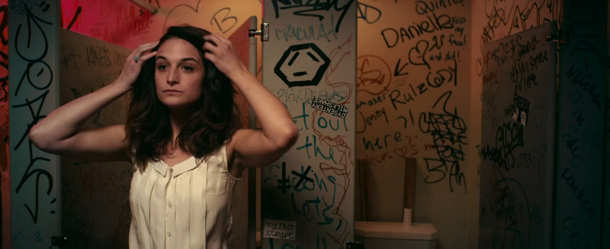
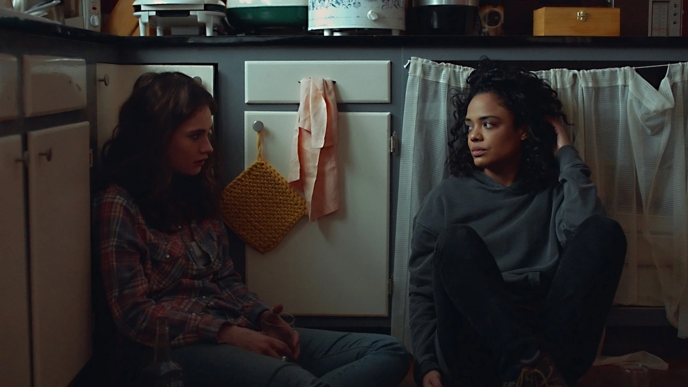
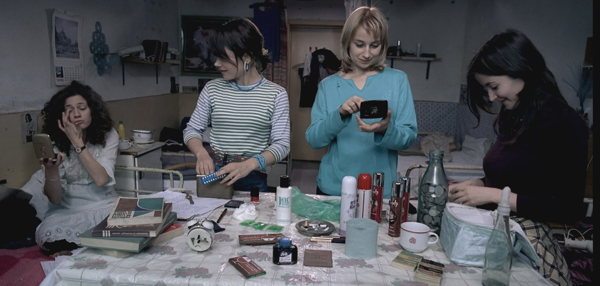
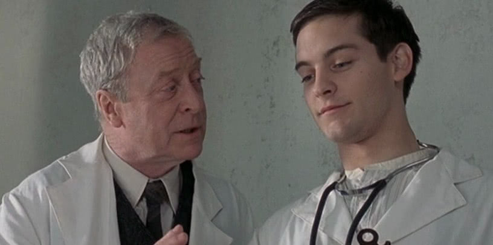
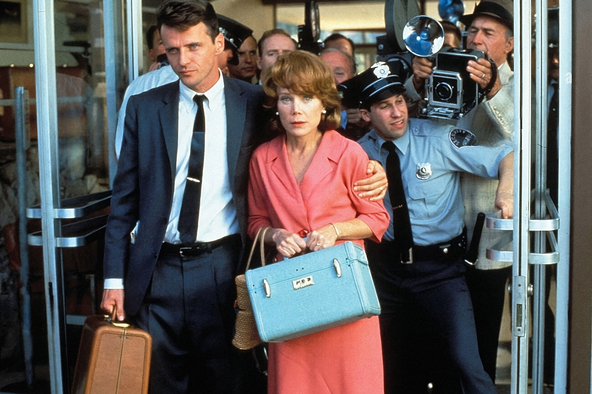

# 5 filmów o aborcji - subiektywna lista { id="top-5-filmow-o-aborcji" }

Aborcja bywa tematem gorącym sporów, a filmy często prezentują ten temat bardzo niedokładnie. Postanowiłyśmy zaprezentować Wam naszą subiektywną listę tych filmów, które warto obejrzeć.

<!-- more -->

## Nasze kryteria wyboru filmów { id="nasze-kryteria" }

Kryteria, które wzięłyśmy pod uwagę to:

- doświadczenie aborcji,
- pomaganie sobie w przerywaniu ciąży,
- polityczny wymiar aborcji

W niektórych filmach aborcja przeplata się jako jeden z mniej ważnych wątków (jak inne doświadczenia życiowe np. rozwód, wyjazd, zmiana pracy), a w pozostałych stanowi podstawę historii.

## Dirty Dancing (1987) – filmowy klasyk { id="dirty-dancing" }

W _Dirty Dancing_ aborcja stanowi bardzo ważny wątek. Johnny szuka partnerki do konkursu tanecznego, bo Penny musi dojść do siebie po niebezpiecznej aborcji. Baby nie tylko pomaga Penny zorganizować pieniądze na zabieg, ale też sprowadza do niej swojego ojca lekarza, a potem ćwiczy z Johnnym do konkursu.

Eleanor Bergstein reżyserka i współproducentka filmu, zapytana o to czemu zdecydowała się na umieszczenie wątku nielegalnej i niebezpiecznej aborcji w filmie o miłości i tańcu, odpowiedziała:

> Prawdziwi ludzie w prawdziwym życiu czasem decydują się na aborcję, nawet wtedy gdy tańczą czy się zakochują.

Bardzo się zgadzamy, aborcja to jedno z wydarzeń w życiu. Może się wydarzyć, lub nie.

## Półsłodki ciężar (Obvious Child, 2014) – realistyczny film o aborcji { id="polslodki-ciezar" }

{ loading=lazy }

Ten film pokazuje aborcję chyba w najbardziej uczciwy i rzeczywisty sposób. Donna zachodzi w nieplanowaną ciążę, nie jest gotowa na macierzyństwo. Razem ze swoim partnerem Maxem idą do kliniki aborcyjnej. Nie będziemy Wam spoilerować!

## Little Woods (2018) – aborcja wśród osób czarnych { id="little-woods" }

{ loading=lazy }

Bardzo trudno jest znaleźć film, który opowiada o aborcji i o osobach o czarnym kolorze skóry, Aborcja bywa tematem gorącym sporów, a filmy często prezentują ten temat bardzo niedokładnie. Postanowiłyśmy zaprezentować Wam naszą subiektywną listę tych filmów, które warto obejrzeć. Aborcja bywa tematem gorącym sporów, a filmy często prezentują ten temat bardzo niedokładnie. Postanowiłyśmy zaprezentować Wam naszą subiektywną listę tych filmów, które warto obejrzeć. dlatego bardzo Wam polecamy ten film.

Ollie mieszka w tytułowym miasteczku Little Woods w Północnej Dakocie. Na tydzień przed zakończeniem wyroku w zawieszeniu za przemyt leków siostra Ollie dowiaduje się o ciąży, której nie może kontynuować. Od najbliższej kliniki dzielą je setki mil, a to nie koniec problemów.

## 4 miesiące, 3 tygodnie i 2 dni (4 Months, 3 Weeks, and 2 Days, 2007) – film o nielegalnym zabiegu aborcyjnym { id="4-miesiace-3-tygodnie-i-2-dni" }

{ loading=lazy }

Rumunia, ostatnie lata panowania Nicolae Ceausescu. Przyjaciółki – Otilia i Gabita współdzielą pokój w akademiku w Bukareszcie. Gabita zachodzi w niechcianą ciążę. Z obawy przed reakcją rodziców i otoczenia podejmuje decyzję o aborcji. Z pomocą w przeprowadzeniu nielegalnego zabiegu przychodzi jej pragmatyczna przyjaciółka.

## Wbrew Regułom (The **Cider House Rules, 1999)** – przeprowadzanie aborcji w filmie { id="wbrew-regulom" }

{ loading=lazy }

Film oparty na powieści Johna Irvinga pod tytułem „Regulamin tłoczni win.” Historia Homera Wellsa, chłopaka z domu dziecka, wychowanego przez lekarza, dr Wilbura Larcha. Larch uczy Wellsa praktyki medycznej, również wykonywania aborcji. Polecamy ze względu na doskonałą grę Charlize Theron, a wątek aborcyjny jest bardzo ciekawie przedstawiony.

## Prywatna Sprawa (A Private Matter, 1992) – film o aborcji oparty na faktach { id="prywatna-sprawa" }

{ loading=lazy }

Film oparty na prawdziwej historii Sherri Finkbine, kobiety, która próbowała zakończyć swoją piątą ciążę z powodu poważnych wad płodu. Wada płodu jest wynikiem zażywania bardzo popularnego w tamtych czasach leku. Historia działa się w Arizona w roku 1962, czyli w czasach, kiedy aborcja w USA była nielegalna i kryminalizowana.

## Więcej filmów i seriali o aborcji { id="wiecej-filmow-i-seriali-o-aborcji" }

Jeśli znasz te filmy albo masz ochotę na oglądanie serialu z aborcyjnym wątkiem, być może zainteresuje cię też nasze [top 10 aborcyjnych seriali i filmów](./aborcja-w-filmach-seriale-o-aborcji-top-10.md) wybrane przez nasze aborcyjne koleżanki, uważaj natomiast na anty-aborcyjną propagandę – np. z filmem „Nieplanowane” rozprawiamy się [pod tym adresem](./film-nieplanowane-to-antyaborcyjna-propaganda-ale-aborcja-na-faktach-rozprawia-sie-z-klamstwami-fundamentalistow.md).