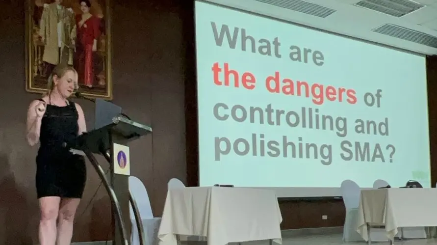

# Międzynarodowa konferencja ekspertek aborcyjnych

Działaczki sieci Aborcja Bez Granic od paru dni biorą udział w konferencji aborcjonistek, lekarzy i ekspertek w zakresie przerywania ciąży z całego świata. Konferencja ma miejsce w Bangkoku - stolicy gorącej Tajlandii. 

Chcemy podzielić się z wami wystąpieniem Kingi Jelińskiej - szefowej Women Help Women pt. *Wszystkie oczy zwrócone na samoobsługę aborcyjną – jak polityka kontroli może wpłynąć na tę (radykalną) praktykę* (eng. *All Eyes On Self-Managed Abortion – How The Politics Of Control Can Affect This (Radical) Practice*).

<!-- more -->

## Wystąpenie Kingi Jelińskiej

??? quote "Kinga Jelińska speech in English :flag_gb:{ .lg .middle }"

    Let’s start with good news: When it comes to abortion technologies and their safety there is nothing much to still invent. It’s not a situation where we still are looking still for a cure or a remedy.

    *(Slide: We pretty much nailed abortion technologies.)*
    
    We have pills, we have well established surgical methods, we have many good models of care, we have self managed abortion and the pills are so safe that they should be sold over the counter. We have more people who would want to provide abortions than commonly believed. 

    *(Slide: So, if that is the case - that we have the technologies, they are easy and safe, where is this wonderland, my Lala land of abortion?)*

    People needed access, we developed many models of abortion care. We needed data and evidence, we researched and got robust evidence. We needed standards, we have decades of experience developing and adjusting protocols. But this is not enough. Never enough. Because, truth to be told, abortion access has rarely have been a matter of healthcare, and regulated according to the evidence.

    *(Slide: Abortion is about control.)*

    Let me tell you the take from my home country: When anti-abortion politicians come to power, the restrictions and criminalization of abortion can happen overnight, even despite and to the outrage of the public.
    When the wheel turns again, and the "progressive" politicians regain power, restoring even the most basic sense of security, this basic clean up is a matter of many months. One truth is certain–

    *(Slide: it is ALWAYS so much easier to break than to fix to abortion access)*

    *(Slide: And what about doctors?)*
    
    They are oftentimes the tangible point of contact between abortion policy and pregnant people. Instead of using their expert decisions against the politicians and the law, they prefer to join the political chorus of moralists and pseudo-philosophers. Medicine has become a hostage of ideology and profits, validated and cemented through criminal laws. Politicians cherish the convenient lie that the abortion issue is solved with laws so they can have their triumphs and pedestals, and repeat ad nauseam that the buddies in white coats are the best experts on abortion. No, they are not, they are often beneficiaries and obstructors. I come from Poland, a country with a history of obstetric violence, where many ob-gyns still conduct medicine as if it is a master and servant relation. They often ignore the needs, they call cops on their patients if they suspect abortion. Let’s call the doctors and politicians for what they have often became – police, cunt-police.

    *(Slide: The marriage of medicalization, criminalization and stigmatization protects profit and the status quo, preventing giving back abortion to common people.)*

    I, myself, am activist provider of self managed abortion operating globally, I work for Women Help Women, Abortion Dream Team, Abortion without Borders, and the Mama Network.

    *(Slide: Self-managed abortion embodies the principles of reproductive justice.)*
    
    It is a practice against the various systems of control. It's a anti-system, anarchist practice – happening not only "despite" but "beyond" the law, building new norms of how we can and should care for each other.
    
    *(Slide: Reproductive justice means also full decriminalization of abortion.)*

    Most abortion laws came into force through the advocacy for organized medicine, medicine that took a monopoly on the practice through criminalization of anything outside of it. It introduced certifications, still present today, deciding who, where,  how and why can provide abortion and created offenses, if anyone was procuring abortion outside of the law.
      
    *(Slide: This leads to a paradoxical situation where we are all – users and providers of self-managed abortion outside of the institutionalized system – at danger of prosecution, even though those practices are safe and recommended even by the World Health Organization... That has happened to Justyna in Poland.)*

    When evidence on self-managed abortion, originated by activists groups operating in very risky environments, got codified in the official recommendations of the WHO, all actors of the field started promotion of the information, appropriating and mainstreaming this in essence anti-control practice. We experience the sanitization and pink washing of self-managed abortion, so it can fit the the old status quo.

    *(Slide: But I ask you – what are the dangers of controlling, polishing and retouching self-managed abortion?)*

    We work from different set of values and principles. And currently, access to medicines fall still disproportionately on activists, who still are in position to beg for pills, buy them too expensive, and risk their own bodies to move them. And the same grassroots movement not only is under-resourced, but often either deliberately erased or infantilized and objectified as partner servant needed to deliver results while the „serious organizations” write reports about them and claim them. 

    I am critical of dynamic of control of self-managed abortion. But I did not come come here just to whine.
    Our answer to control is a radical and uncontrollable practice of self managed abortion – we have abortions and support people to have it. And wanna know a secret? Perfect order in abortion actually does exists – it is a sum of abortion chaoses.  

    So practice abortion in abundance, practice it here, there and everywhere, do it excessively and obscenely, shamelessly celebrate it and jerk off to it, eat pizza, drink wine or and smoke a joint after, shit and puke, and after put glitter in your blood, mess and play around with abortion, and please keep on innovating it. Let’s inform about abortion, let’s give abortion easily and happily let’s produce it  and  own it only to be able to finally communistically share it. When we take the power ourselves and share it with our communities, when we collectively defend and care for each other, the creeps in charge of systems of control, start to first freak out, then to call us pest and scam, and finally crawl and collapse. So do do it harder, better, faster, stronger. And deeper. I dare you and cheer you be proud and loud abortion slut.

### Współczesne metody aborcyjne są rewelacyjne

Zacznijmy od dobrych wieści: jeżeli chodzi o techniki wykonywania aborcji i ich bezpieczeństwo to już wiele więcej nie da się osiągnąć. Nie jesteśmy już na etapie poszukiwań leku czy kuracji.

*(Slajd: Niemal do perfekcji opanowałyśmy techniki aborcyjne.)*

Są tabletki, są sprawdzone metody chirurgiczne, są dobre wzorce opieki aborcyjnej, jest samoobsługa aborcyjna. Tabletki są tak bezpieczne, że powinny być dostępne bez recepty. Jest też znacznie więcej osób chętnych zapewniać opiekę aborcyjną, niż mogłoby się wydawać.

*(Slajd: Skoro tak wygląda sytuacja – techniki istnieją, są łatwe i bezpieczne, to gdzie jest ta kraina marzeń, mój aborcyjny Lala land?)*

Potrzebny był dostęp – opracowałyśmy liczne wzorce opieki aborcyjnej. Potrzebne były dane i dowody – zrobiłyśmy badania i uzyskałyśmy solidne dowody. Potrzebne były standardy – mamy dekady doświadczenia w rozwijaniu i dostosowywaniu protokołów. Ale to nie wystarcza. Powiedzmy sobie szczerze, dostęp do aborcji rzadko kiedy jest wyłącznie kwestią ochrony zdrowia i dowodów naukowych.

### Ograniczenie dostępu do aborcji

*(Slajd: W aborcji chodzi o kontrolę)*

Podzielę się z wami obserwacją z mojego kraju: kiedy antyaborcyjni politycy dochodzą do władzy, kryminalizacja i ograniczenia dostępu do aborcji mogą nadejść z dnia na dzień, nawet wobec i pomimo oburzenia społeczeństwa.
Kiedy role się odwracają i „progresywni” politycy odzyskują władzę, odbudowanie podstawowego poczucia bezpieczeństwa zajmuje wiele miesięcy. Jedno jest pewne...

*(Slajd: ZAWSZE łatwiej jest zburzyć dostępność aborcji niż ją odbudować.)*

### Rola lekarzy w anty-aborcyjnej polityce

*(Slajd: A co z lekarzami?)*

To oni często stanowią punkt realnego zetknięcia się osób w ciąży z polityką aborcyjną. Zamiast wykorzystywać swoją specjalistyczną wiedzę przeciwko politykom i prawu, wolą przyłączać się do chóru moralistów i pseudofilozofów.

Medycyna stała się zakładniczką ideologii i zysków, a jej granice wyznacza kodeks karny. Politycy uwielbiają to wygodne kłamstwo, które mówi, że kwestia aborcji, może zostać rozwiązana poprzez prawo. To daje im szansę święcenia triumfów i stawania na piedestałach. Powtarzają przy tym do znudzenia, że ich kumple w białych kitlach są najlepszymi ekspertami od aborcji. A wcale nimi nie są, za to nieraz są beneficjentami status quo i hamulcowymi zmian. 

Pochodzę z Polski, kraju z długą historią przemocy położniczej, gdzie wielu ginekologów nadal praktykuje medycynę tak jakby stawiała ich wobec pacjentek w pozycji Pana. Często ignorują potrzeby pacjentek, wzywają policję jeżeli podejrzewają aborcję. Nazwijmy lekarzy i polityków po imieniu: *policja*, *CIPOlicja*.

*(Slajd: Mariaż medykalizacji, kryminalizacji i stygmatyzacji chroni status quo i uniemożliwia powrót aborcji w ręce zwykłych ludzi)*

### Oddolne wsparcie aborcyjne

Ja sama jestem działającą na całym świecie aktywistką zapewniającą dostęp do samoobsługi aborcyjnej. Pracuję dla Women Help Women, Aborcyjnego Dream Teamu, Aborcji Bez Granic i Mama Network.

*(Slajd: Samoobsługa aborcyjna jest ucieleśnieniem sprawiedliwości reprodukcyjnej)*

Samoobsługa aborcyjna jest praktyką występującą przeciwko rozmaitym systemom kontroli. Jest antysystemem, anarchistyczną praktyką – ma miejsce nie tylko „wbrew” prawu, ale poza jego zasięgiem. Tworzy nowe horyzonty tego w jaki sposób możemy i powinnyśmy dbać o siebie nawzajem.

### Kto ma monopol na aborcję?

*(Slajd: Sprawiedliwość reprodukcyjna oznacza pełną dekryminalizację aborcji)*

Większość przepisów aborcyjnych powstała w wyniku działania organizacji medycznych. Medycyna stworzyła monopol na aborcję poprzez kryminalizację wszelkich praktyk nie mieszczących się w jej ramach. Stworzono istniejące do dziś licencje, które decydują kto, gdzie i kiedy może robić aborcję. Robienie aborcji poza kontekstem określonym w prawie stało się przestępstwem.

*(Slajd: To prowadzi do paradoksalnej sytuacji, w której my wszystkie – użytkowniczki i dostarczycielki samoobsługi aborcyjnej poza zinstytucjonalizowanym systemem – jesteśmy narażone na zarzuty karne, mimo tego że nasza praktyka jest bezpieczna i rekomendowana nawet przez Światową Organizację Zdrowia. To właśnie przytrafiło się w Polsce Justynie.)*

Kiedy dowody na efektywność samoobsługi aborcyjnej, rozwiniętej przez często ponoszące duże ryzyko aktywistki, zostały skodyfikowane w zaleceniach WHO, wszyscy zainteresowani zaczęli rozpowszechniać te informacje, przejmować i przenosić do głównego nurtu tę z gruntu wymykającą się kontroli praktykę. Obserwujemy rozmywanie i ugrzecznienie samoobsługi aborcyjnej, mające prowadzić do znalezienia dla niej miejsca w obowiązującym status quo.

### Konsekwencje kontrolowania aborcji

{ align=right }

*(Slajd: Mam do was pytanie: jakie jest ryzyko kontrolowania, polerowania i upiększania samoobsługi aborcyjnej?)*

Pracujemy w oparciu o inny zbiór wartości i zasad. W tej chwili zapewnienie dostępu do leków wciąż w znacznym stopniu spoczywa na barkach aktywistek, które są zmuszone błagać o tabletki, kupować je po zawyżonych cenach i ryzykować własnymi ciałami, by je przetransportować. Ten oddolny ruch jest nie tylko niedofinansowany, ale też często umyślnie wymazywany, infantylizowany czy umniejszany do roli sługi, który potrzebny jest do zapewnienia rezultatów, podczas gdy „poważne organizacje” piszą o nim raporty i przypisują sobie jego zasługi.

Jestem nastawiona krytycznie do prób kontrolowania samoobsługi aborcyjnej. Ale nie przyszłam tu tylko po to by narzekać.

Naszą odpowiedzią na kontrolę jest radykalna, nieokiełznana praktyka samoobsługi aborcyjnej – robimy aborcje i wspieramy osoby, które mają aborcje. Powiedzieć wam sekret? **Istnieje idealny porządek aborcyjny – jest on sumą aborcyjnych chaosów.**

### Aborcyjny apel

Zatem obfitujcie w aborcję, róbcie ją tu, tam i wszędzie indziej. Róbcie ją przesadnie i obscenicznie. Bezwstydnie ją czcijcie i masturbujcie się do niej. Jedzcie pizzę, pijcie wino, palcie blanty, srajcie i rzygajcie, a na koniec obsypcie swoją krew brokatem. 

Wygłupiajcie się i bawcie się aborcją i proszę was nie przestawajcie szukać ulepszeń. 

Informujmy o aborcji, rozdawajmy ją łatwo i z radością, produkujmy ją i posiadajmy, po to by móc się nią potem "po komunistycznemu" podzielić. 

Kiedy bierzemy tę władzę w swoje ręce i obdarowujemy nią nasze społeczności, kiedy wspólnie dbamy o siebie i się bronimy, te oblechy zawiadujące systemami kontroli głupieją. Potem nazywają nas szkodnikami i szumowinami, a na końcu zaczynają pełzać i znikać. 

A zatem róbcie to mocniej, lepiej, szybciej, silniej. I głębiej. Wyzywam was i dopinguję, żebyście stały się dumnymi aborcyjnymi dziwkami.

