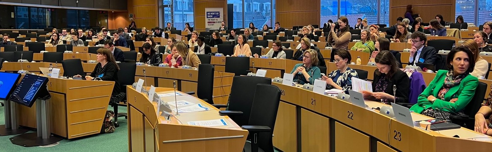
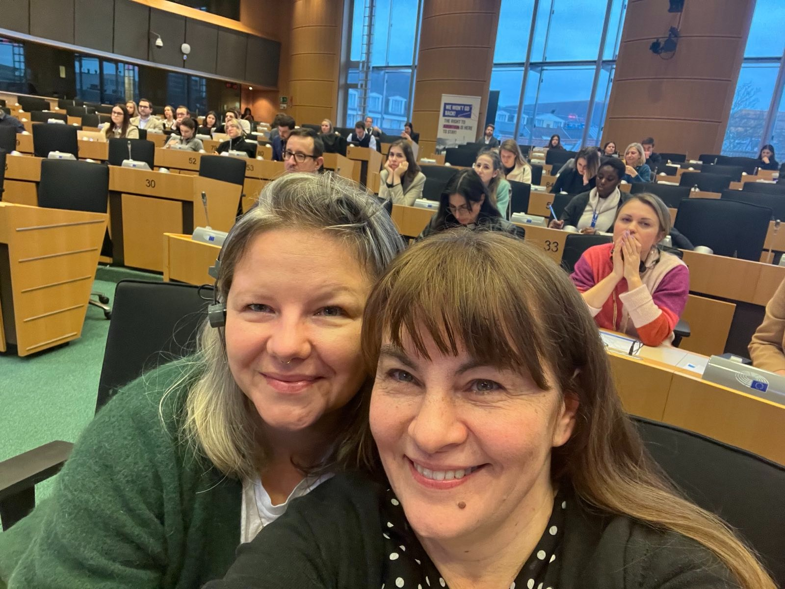

---
date: 2023-02-01
time: 19:21
tags:
  - Justyna Wydrzyńska
  - Aborcja farmakologiczna
categories:
  - Organizacje aborcyjne
  - Polityka

postImage: yes
postImagePath: /news/assets/images/justyna-w-europarlament/wystapienie-justyny-wydrzynskiej.jpeg
postImageHeight: 60%
postImageTitle: Justyna Wydrzyńska, na zaproszenie Renew Europe, mówi o aborcji w Europarlamencie
postImageAlt: Justyna Wydrzyńska przemawia w Europalrmencie.
postImageSource: yes
postImageSourceText: Sexual and reproductive rights at stake
postImageSourceUrl: https://app.livecasts.eu/simone-veil-pact-empowering-women-now/program
---  

# Justyna Wydrzyńska mówi o aborcji w Europarlamencie { id="justyna-wydrzynska-o-aborcji-w-europarlamencie" }

Na zaproszenie *Renew Europe* Aborcyjny Dream Team pojawił się dzisiaj w Europarlamencie aby opowiedzieć o polskiej rzeczywistości aborcyjnej.

<!-- more -->

W ramach panelu *Sexual and reproductive rights at stake* Justyna opowiedziała nie tylko o tym jak wygląda codzienna praca ADT i Aborcji Bez Granic od wyroku Trybunału Konstytucyjnego, ale też o warunkach na jakie jesteśmy skazane przez ograniczenia antyaborcyjne – te z 2020, i te z 1993.

Przybliżając dramatyczną sytuację polskich działaczek aborcyjnych Justyna zwróciła również uwagę na to, że **całe europejskie prawodawstwo jest do tyłu względem wiedzy naukowej i rekomendacji WHO.** Opowiedziała o tym, że niemal każdy kraj ma swoje arbitralne warunki utrudniające dostęp do aborcji – warunki niezgodne z rzeczywistymi potrzebami kobiet.

Podkreśliła również, że do aborcji farmakologicznej nie ma potrzeby angażować lekarza, a cały proces może zostać przeprowadzony przez osobę w jej własnym domu, na własnych zasadach. Rozmontowując mit o "aborcji tylko pod okiem personelu medycznego" powtórzyła zalecenia WHO – aborcja farmakologiczna w domu jest bezpieczna, a mifepriston i mizoprostol powinny być dostępne w każdej aptece bez recepty.

Za przekazanie tych właśnie bezpiecznych tabletek innej kobiecie [Justyna została postawiona przed sądem](../../jak-justyna.md). Grożą jej 3 lata więzienia – tylko za to, że chciała pomóc osobie móc zadecydować o jej własnym zdrowiu reprodukcyjnym.

## Wystąpienie Justyny Wydrzyńskiej w Europarlamencie { id="wystapienie" }

> Nazywam się Justyna Wydrzyńska i od 16 lat pomagam w aborcjach w Polsce. Na codzień jestem jedną z osób, która odbiera telefon infolinii Aborcja Bez Granic, działający od grudnia 2019 roku. **Codziennie od 8:00 do 20:00 można zadzwonić na numer 22 29 22 597 i uzyskać wsparcie w aborcji.**
>
> Nie jesteśmy teoretyczkami – zajmujemy się praktyczną pomocą w przerywaniu ciąży. Podpowiadamy skąd zamówić bezpieczne tabletki, jak przygotować się do aborcji farmakologicznej, co będzie się działo w trakcie, przeprowadzamy osoby przez cały proces.
>
> Polska obok Malty ma najsurowsze przepisy antyaborcyjne w Europie. Dwa lata temu upolityczniony przez rząd Trybunał Konstytucyjny zakazał aborcji w przypadku wad płodu. Jako Aborcja Bez Granic, tylko w ciągu ostatnich dwóch lat, pomogłyśmy ponad 100 tysiącom osób z Polski w dostępie do bezpiecznej aborcji. **To średnio 107 aborcji każdego dnia**.
>
> Pomagamy także organizować aborcje w zagranicznych klinikach, opłacić zabieg, wyjazd i pobyt. Od wyroku TK ponad 2 tysiące osób pojechało z nami na zabieg aborcji chirurgicznej do zagranicznej kliniki.
>
> Chcę podzielić się z państwem chociaż częścią tego doświadczenia.
>
> Co tydzień spływają do nas [historie kolejnych kobiet](../../../mialam-aborcje/index.md), które starały się o aborcje w polskim szpitalu.
>
> Traktowanych protekcjonalne i wrogo przez lekarzy Polek. **Ukrainek zadających sobie pytanie “Czemu nie jest normalnie, tak jak było w Ukrainie?”. Kobiet spławianych słowami “w innym szpitalu”.** Osób potrzebujących natychmiastowej pomocy, które odbijają się od religijnych fanatyków i tchórzy w białych fartuchach.
>
> Gdy kobiety wyjeżdżają z nami do Holandii, Belgii, Anglii, Francji, Niemiec, Czech czy Austrii na aborcję są wręcz zaskoczone tym, jak po ludzku zostały potraktowane.
> 
> Jednak wyjazdy to jedyne 1% wszystkich aborcji, które pomagamy załatwić. Tylko procent, bo **istnieje lepsza metoda przerywania ciąży.** Metoda rekomendowana przez Światową Organizację Zdrowia: bezinwazyjna, bezpieczna – bezpieczniejsza niż ciąża, bezpieczniejsza niż wyrywanie zęba, czy nawet tabletka viagry… Metoda nie wymagająca nawet znieczulenia; metoda która zgodnie z WHO nie wymaga lekarza i można zrobić ją samodzielnie w domu.
> 
> **Tą metodą jest aborcja farmakologiczna**. Większość kobiet w Polsce i na świecie w celu przerwania ciąży zażywa tabletki aborcyjne _(w tym momencie Justyna pokazała zestaw tabletek poronnych)_, czyli zestaw mifepristonu i mizoprostolu zamówiony od międzynarodowej fundacji Women Help Women.
> 
> Ja też tak przerwałam swoją ciążę. Na własnej skórze przekonałam się, że w Polsce kobiety nie mogą liczyć na państwo, lekarzy, polityków. Ale **mogą liczyć na siebie nawzajem.**
>
> Dokładnie takie tabletki, cytując znowu Światową Organizację Zdrowia, _powinny być dostępne wszędzie._ Takie tabletki wysłałam w 2020 roku do kobiety, która zgłosiła się po pomoc do Aborcji Bez Granic. Grożą mi za to 3 lata więzienia. W ten poniedziałek, 6 lutego, odbędzie się moja piąta rozprawa sądowa. Na ostatniej rozprawie zeznawał mężczyzna, który próbował zmusić do donoszenia ciąży kobietę której pomogłam – zeznawał nie jako oskarżony o przemoc, a jako świadek. Dodatkowo jest wspierany przez religijnych fanatyków, którzy biorą udział w rozprawie reprezentując _„interesy płodu i jego następców”_.
>
> **Mimo tej absurdalnej sytuacji i zupełnie realnych wyniszczających mnie represji, nadal wierzę, że każda empatyczna osoba wybrałaby pomoc innej kobiecie nawet ryzykując swoje bezpieczeństwo.**
>
> Ja wiem, że zrobiłabym to jeszcze raz. **Czuję, że nie jestem winna.** Dobrowolne wsparcie innej kobiety w potrzebie nigdy nie jest przestępstwem. Nie jest czymś czego którakolwiek z nas powinna się wstydzić.
>
> Pomaganie w aborcjach jest konieczne, zwłaszcza gdy żyje się w kraju takim jak Polska, gdzie cały dostęp do aborcji zepchnięty jest na nieformalne inicjatywy i organizacje pozarządowe.
>
> **To właśnie my, działaczki, robimy redukcję szkód, które każdego dnia wyrządza nam polska ustawa antyaborcyjna. To moment, żeby szczerze powiedzieć, że brak systemowego dostępu do aborcji w Polsce funkcjonuje od 30 lat, a nie tylko od 2020 i nieszczęsnego wyroku trybunału konstytucyjnego, który oczywiście sytuację jeszcze pogorszył.**
>
> Nawet w przypadkach które prawo obejmuje, mimo tego, że lekarze mają wszystkie potrzebne dyplomy, to nie znają wytycznych i nie potrafią robić aborcji. Gdy już je robią, to archaicznymi inwazyjnymi metodami. Albo nie robią ich w ogóle.
> 
> Zdarza nam się w Aborcji Bez Granic odbierać telefony od przerażonych ciężarnych kobiet, które leżą w szpitalach z zagrożeniem sepsy i właśnie powoli umierają. Bo lekarze czekają z działaniem aż najpierw “naturalnie” obumrze płód. Tak właśnie zmarła Iza z Pszczyny, Agnieszka z Częstochowy.
>
> Pomaganie w aborcjach w Polsce jest minimalizacją ryzyka utraty zdrowia, a nawet minimalizacją ryzyka tragicznej śmierci. **Pomaganie w aborcjach w Polsce jest koniecznością.**
> 
> Nie będę jednak państwa okłamywała: nie tylko w Polsce za przekazanie tych tabletek mogłabym trafić do więzienia. Mówiąc szczerze, każde europejskie państwo, łącznie z tymi które wspierają finansowo naszą pracę lub piszą do polskiego rządu z żądaniami o wycofanie zarzutów, każde z nich mogłoby mi takie zarzuty mi postawić – za przekazanie leków do aborcji bez “odpowiedniej licencji”.
> 
> Europejskie prawodawstwo, nie tylko polskie, jest potężnie opóźnione w stosunku do wiedzy naukowej i rekomendacji Światowej Organizacji Zdrowia. **Niemal każdy kraj ma swoje arbitralne warunki utrudniające dostęp do aborcji. Warunki absurdalne, niezgodne ze stanem wiedzy naukowej, ale przede wszystkim niezgodne z potrzebami kobiet.**
>
> Niektórzy z państwa pewnie myślą: aborcja tabletkami w domu? Bez lekarza? Czy to nie groźne? Trzeba to jakoś uregulować!
>
> **Mit “bezpiecznej aborcji, gwarantowanej prawem ale tylko w szpitalu” jest tylko mitem.** Bezpieczna aborcja farmakologiczna nie wymaga lekarza i szpitala – wymaga bezpiecznego i spokojnego domu. Wymaga braku społecznej stygmy. Tak brzmią wytyczne WHO: kitel jest tylko na skrajnie sytuacje i poważne powikłania. Polska jest dowodem na to, że wystarczy poddać w wątpliwość jedną z ustaw “gwarantujących aborcję”, a lekarze masowo przestaną ją wykonywać i będą ryzykować życiami pacjentek – a nie swoją pracą.
>
> Zwracam się do państwa: aborcja nie może być elementem gry politycznej. **Prawo aborcyjne nie może powstawać poprzez licytację wąskimi sytuacjami, na które prawo zezwoli. Bo takie licytacje “wyjątkowych sytuacji” czasem wygrywają stronnictwa progresywne, ale czasem wygrywają fanatycy. Jednak zawsze, ale to zawsze, tę licytację przegrywają kobiety.** Teraz gdy dostęp do aborcji w moim kraju jest przedmiotem ideologicznej nagonki, teraz gdy działaczki ściga upolityczniona prokuratura, pomoc kobietom wymaga ogromnych środków: i ludzkich, i finansowych.
>
> Jako Aborcja Bez Granic w ciągu ostatnich dwóch lat przeznaczyłyśmy na ratowanie kobiet ponad 2 miliony polskich złotych. Aborcje kosztują i sieć ABG potrzebuje pieniędzy z Europy, żeby móc te bezpieczne aborcje zapewnić na jak najlepszym poziomie. Opieka aborcyjna może być przyjazna i empatyczna, może być godna – i o taką właśnie dostępną aborcję walczymy.
>
> Otrzymałyśmy wsparcie nie tylko indywidualnych darczyńców, ale też innych europejskich państw. Jednym z nich była Belgia – z inicjatywy ministry ds równości Sary Schlitz Aborcja Bez Granic otrzymała już dwukrotnie wsparcie finansowe na organizację zabiegów, za co jesteśmy bardzo wdzięczne. Polki, a także Ukrainki, szczególnie teraz w trakcie wojny i kryzysu ekonomicznego, potrzebują takiej solidarności i tego wsparcia. Będąc tu, w europejskim parlamencie, czuję się zobowiązana powiedzieć państwu o tym wprost.
>
> Chcę podziękować za wszystkie głosy i oznaki wsparcia, które już dostaliśmy. Są one bezcenne.

Mówiła Justyna Wydrzyńska na panelu “Sexual and reproductive rights at stake” w europarlamencie.

