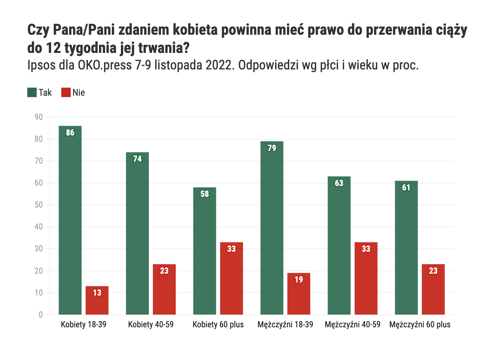
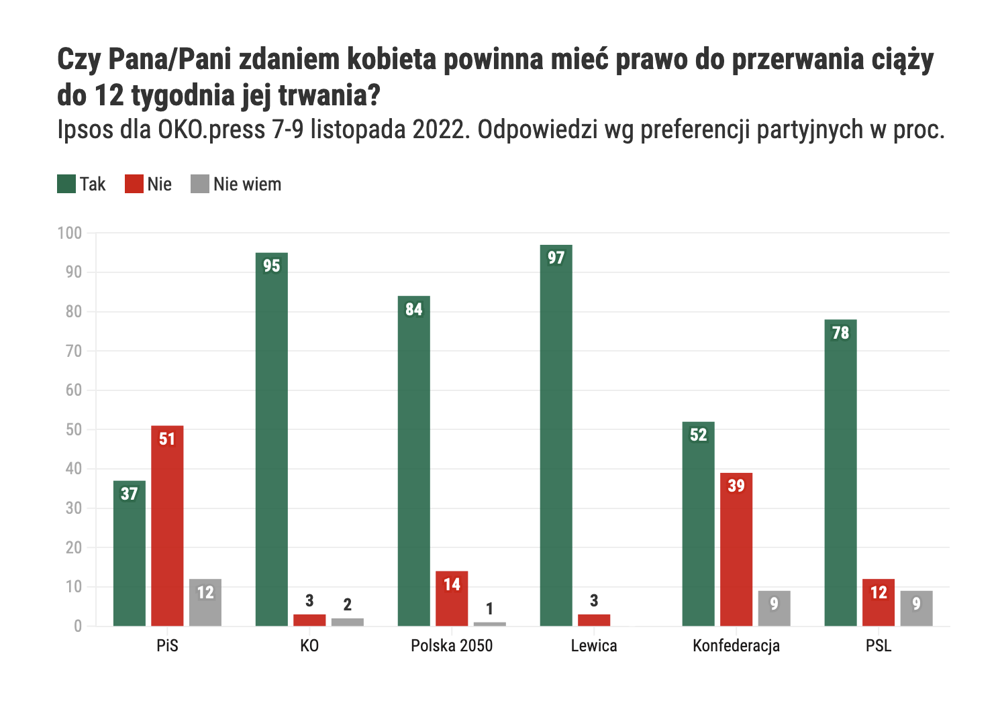

# Referendum aborcyjne - czy prawo do przerywania ciąży powinno zostać poddane ogólnopolskiemu referendum?

## Jak zagłosowaliby Polacy i Polki?

Bez wątpienia społeczne popracie dla aborcji jest bardzo wysokie, wynosi ponad 70% dla całej populacji, w śród młodych osób dochodzi do 86%&nbsp;[^1]! Według najnowszych sondaży: 

> Aż 75 proc. Polek i Polaków, deklarujących udział w referendum, głosowałoby za prawem kobiet do przerywania ciąży do 12. tygodnia[^2]. Sondaż Ipsos pokazuje, że aborcja stała się tematem uniwersalnym, kwestią społeczną, a nie "światopoglądową", jak chętnie (lecz błędnie) nazywali ją dotąd politycy.

[^1]: Oko.press [Takiego wyniku jeszcze nie było! Rekordowe poparcie dla aborcji do 12. tygodnia](https://oko.press/rekordowe-poparcie-dla-aborcji-do-12-tygodnia-sondaz-oko-press), 15 listopada 2022
[^2]: Oko.press: [Większość Polek i Polaków poszłaby na referendum. I zdecydowanie wybrała prawo do aborcji](https://oko.press/wiekszosc-polek-i-polakow-wzielaby-udzial-referendum-i-wybrala-legalna-aborcje-sondaz), 30 marca 2023

### Ile procent młodych osób popiera aborcję?

Aborcję popierają tym bardziej młode osoby: aż 86% kobiet między 18, a 39 rokiem życia jest za aborcją. W tej samej grupie wiekowej aborcję popiera 79% mężczyzn&nbsp;[^3]. Na podstawie obecnych danych można szacować, że osoby przed 18 rokiem życia tym bardziej uważają, że aborcja jest czymś normalnym i niekontrowersyjnym.

??? info "Zobacz wykres popracia dla aborcji w zależności od płci i wieku"

    

[^3]: Oko.press [Takiego wyniku jeszcze nie było! Rekordowe poparcie dla aborcji do 12. tygodnia](https://oko.press/rekordowe-poparcie-dla-aborcji-do-12-tygodnia-sondaz-oko-press), 15 listopada 2022

### Jaki elektorat popiera aborcję?

Wbrew temu co próbują osiągnąć politycy przekonujący, że aborcja jest *"kontrowersyjnym tematem"* elektoraty niemal wszystkich partii zdecydowanie opowiadają się za legalą aborcją&nbsp;[^4].

* Wyborcy Lewicy, Koalicji Obywatelskiej, Polski 2050 a nawet PSL zdecydowanie opowiadają się za prawem do przerywania ciąży (odpowiednio 97%, 95%, 84% i 78%)
* Jedynie osoby głosujące na Konfederację uważają aborcję za *"kontrowersyjny"* temat gdyż chociaż 52% ją popiera to równocześnie, aż 39% osób jest przeciwnych, by konieta mogła podjąć taką decyzję o swojej ciąży.
* Statystycznie **jednynymi** osobami w Polsce, które częściej są przeciwne prawu do aborcji, niż je wspierają są wyborczy PiS - 51% z nich nie popiera prawa do aborcji, 12% nie wie jak się do niego ustosunkować... ale mimo to aż 37% z nich uważa, że kobiety powinny móc przerwać ciążę conajmniej do 12 tygodnia.

[^4]: Oko.press: [Większość Polek i Polaków poszłaby na referendum. I zdecydowanie wybrała prawo do aborcji](https://oko.press/wiekszosc-polek-i-polakow-wzielaby-udzial-referendum-i-wybrala-legalna-aborcje-sondaz), 30 marca 2023

??? info "Zobacz wykres poparcie dla aborcji w zależności od poglądów politycznych"

    

Co więcej, w porównaniu do poprzednich badań, widać, że **popracie dla aborcji nadal rośnie.**

## Skoro wszyscy popierają aborcję, to czemu referendum to wielki błąd?

Przeciwko referendum można wysunąć dwa rodzaje argumentów:

1. Nie można przeprowadzać referendum, którego wynik *mógłby w teorii* ograniczyć prawa człowieka, prawa reprodukcyjne- tu prawa kobiety do kontroli nad własnym ciałem i płodnością.
2. Chociaż pomysł referendum na papierze brzmi fajnie (*"zapytajmy ludzi czy chcą aborcji i zróbmy tak ja odpowiedzą"*), to w rzeczywistości wiąże się z nim wiele zagrożeń, z których mogą skorzystać anty-kobiecy politycy **niezależnie** od społecznego poparcia dla aborcji czy nawet jego wyniku.

Obie agumentajce omawiamy osobno:

[1. Prawa człowieka i kwestia ludziej godności](#prawa-czlowieka) 
oraz [2. Lista poważnych wad i luk w idei referendum](#wady-idei-referendum).

## Prawa człowieka i przyrodzona godność { id="prawa-czlowieka-i-godnosc" }

Powiedzmy to wprost:

> Mamy dosyć kompromisów w sprawie naszych ciał, w sprawie naszych żyć! A tym jest idea referendum - kompromisem.

Fakty są następujące:

* Doświadczenie aborcji jest niemal codziennością, może się pojawić i pojawia się w życiu każdej z nas. Nawet 1/3 Polek miała w swoim życiu przynajmniej jedną aborcję&nbsp;[^5].
* Aborcja nie zawsze jest trudną decyzją i nie ma powodu, by na siłę chronić przed nią kobiety. Jak pokazują badania, po aborcji zdecydowana większość kobiet odczuwa ulgę&nbsp;[^6], a żal pojawia się tylko z wyjątkowo rzadkich przypadkach i równie często nie dotyczy samej aborcji, co tego z jaką stygmą i życiowymi trudnościami może się ona wiązać&nbsp;[^7].

[^5]: "Doświadczenia aborcyjne Polek" [CBOS 2013](https://www.cbos.pl/SPISKOM.POL/2013/K_060_13.PDF) <small>[kopia archiwalna](../do-pobrania/info/cbos-maj-2013-doswiadczenie-aborcyjne-polek.pdf)</small>
[^6]: [Decision Rightness and Emotional Responses to Abortion in the United States: A Longitudinal Study.](https://www.ncbi.nlm.nih.gov/pmc/articles/PMC4496083/) Rocca C. i in., 2015. PLoS One, 10(7), s. e0128832. doi: 10.1371/journal.pone.0128832
[^7]: jw

Aborcja bywa trudna i bywa łatwa. Jest jednym z tysięcy doświadczeń osoby, która się na nią decyduje. I nawet jeśli koniec końców okaże się, że ta decyzja nie była dobra – to czy jako dorosłe osoby nie możemy podejmować złych decyzji? **Dlaczego akurat przed tą decyzją o swoim życiu politycy na siłę próbują nas chronić?**

### Mężczyźni będą głosować o prawach kobiet?

Pomysł referendum w sprawie aborcji **ubliżanie naszemu prawu do samostanowienia**. Nikt, czy na drodze referendum czy w jakikolwiek inny sposób, nie ma prawa decydować o naszym ciele, decycjach czy płodności.

Referendum to także niebezpieczne narzędzie polityczne mogące służyć do manipulowania opinią publiczną i umniejszenia wagi dostępności aborcji. **Dlaczego ogół obywateli miałby decydować o tym, jakie decyzje możesz podejmować, kiedy to ty jesteś w ciąży?** Może zamiast pytać całej Polski, co masz robić ze swoim ciałem, możesz sama podjąć za siebie decyzję? 

## Lista prawnych i logicznych wady referendum { id="wady-idei-referendum" }

### Jakie zagrożenia rodzi referendum? (skrót)

Referendum nie jest takie proste, jak kreują je politycy do niego namawiający. Politycy zręcznie unikają sensownych odpowiedzi na to **jak będą brzmiały pytania w referendum**. Jeśli zostaną sformułowane tendencyjnie lub bez sensu, to w jaki sposób ogół obywateli miałby się o wypowiedzieć? Obawy takie nie są bezpodstawne, wszak o treści pytań decydowali, by anty-aborcyjni politycy.

Również nawet pozytwny wynik referendum to nie wszystko: **nie wystarczy, że większość obywateli czegoś chce.** Liczy się także to, jak rezultaty głosowania zinterpretują rządzący i jak wprowadzą je w życie. Może się okazać, że twój głos w referendum na "tak" lub na "nie' przełoży się na przepisy, które są sprzeczne z twoją wolą, albo w ogóle nie odpowiadają na potrzeby kobiet.

Niektóre osoby mogą uważać, że to dmuchanie na zimne i dzięki referendum mogłybyśmy mieć "raz dwa" legalną aborcję w Polsce. W tym zdaniu kryje się jednak poważne niezrozumienie tematu:

{==

Naszym celem nie jest *po prostu legalizacja* aborcji&nbsp;[^8]. Chcemy, żeby aborcja była **dostępna i bezpieczna.** A to nie zawsze to samo&nbsp;[^9].

==}

[^8]: Faktyczna treść prawa i projektów ustaw jest kluczowa, dlatego jako ADT brałyśmy udział w tworzeniu ustawy "Bezpieczna aborcja bez kompromisów". Będziemy również wspierać każdy projekt ustawy, której celem jest zagwarantowanie **realnego** dostępu do bezpiecznej aborcji na zasadach odpowiadających naszym wartościom.
[^9]: Współczesny przykład Irlandii pokazuje, że mimo ogromnego społecznego poparcia dla aborcji, przeprowadzenia referendum w jej sprawie (zakończonego sukcesem) i w końcu wdrożenia projektów legalizujących, to **rzeczywisty** dostęp do aborcji nadal jest tam bardzo trudny.

### Dziurawe przepisy

Warto przyjrzeć się przepisom dotyczącym referendów w Polsce. Zgodnie z prawem w Polsce mogą odbyć się trzy rodzaje referendów:

* dotyczące "spraw o szczególnym znaczeniu dla państwa",
* ratyfikacji umów międzynarodowych 
* i zmian w Konstytucji. 

Te dwa ostatnie typy są dosyć dobrze opisane i uregulowane. Ale przepisy dotyczące referendów o "sprawach o szczególnym znaczeniu dla państwa" są tylko luźno zarysowane. Swoją drogą, nie wiemy w jaki sposób aborcje są "sprawą o szczególnym znaczeniu dla państwa", ale to nie w tym leży problem. Najważniejszym problemem związanym z referendum aborcyjnym jest to **kto i z jaką intencją ułoży jego pytania.** 

### Problemy z pytaniami o aborcję { id="problemy-z-pytaniami" }

W wielu krajach referenda mogą dotyczyć tylko przyjmowania konkretnych ustaw. Gdyby tak było w Polsce, pytanie brzmiałoby *"Czy jesteś za przyjęciem ustawy XYZ?"*. Wtedy każda zainteresowana osoba mogłaby wcześniej zapoznać się z treścią proponowanej ustawy.

Niestety, w Polsce pytania referendalne mogą dotyczyć... czegokolwiek (poza kilkoma kwestiami, m.in. amnestii i podatków), a wprowadzanie w życie wyników takich głosowań może być różnie interpretowane. 

Zależnie od tego, kto układałby pytania w *referendum aborcyjnym* mogłyby one brzmieć np. tak:

- czy popierasz zabijanie dzieci nienarodzonych?
- czy dzieci z zespołem Downa powinny być zabijane?
- czy chciałbyś/chciałabyś, żeby aborcja była w Polsce bezpieczna, dostępna i legalna?
- czy zgadzasz się na przeprowadzanie aborcji po 12. tygodniu życia płodu?
- czy ojciec płodu powinien wyrazić zgodę na aborcję?
- czy aborcję powinna poprzedzać konsultacja z lekarzem?
- czy aborcja powinna obowiązkowo odbywać się w placówce medycznej?
- czy aborcja do 12 tygodnia ciąży powinna być legalna niezależnie od powodu?
- czy można karać za aborcję przeprowadzoną poza szpitalem?

Problemy z niektórymi pytaniami widać na pierwszy rzut oka, jednak każde z nich może stworzyć poważny problem:

* Niektóre z propozcyji pytań są "obciążone ideologicznie" - np.: na wstępie zrównują płód z dzieckiem czy określają aborcję zabójstwem. To silnie sugerujące i może wprowadzić kogoś w błąd.
* Inne pytania mogą dotyczą regulacji, które na pierwszy rzut oka mogą wydawać się sensowne, jednak są tak naprawdę [anty-aborcyjne](./anty-aborcyjne-regulacje.md), jak np.: obowiązek konsultacji z lekarzem (którą ustawodawca może rozpisać sobie jako niemal  niemożliwie skomplikowaną do ukończenia).
* Niektóre mogą penalizować aborcję bardziej niż jest ona utrudniona obecnie - np.: aborcja w domu, poza szpitalem jest według badań i opini WHO bezpieczniejsza niż coraz bardziej archaiczne metody stosowane w szpitalach.
* Jeszcze inne pytania są zbyt ogólne - bo każdy może zinterpretować słowa "bezpieczna, dostępna i legalna" jak tylko chce.

### Czy referendum pociągnie za sobą zmiany prawne? { id="zmiany-w-prawie" }

Idźmy dalej: żeby referendum było ważne (czyli legalne) nie trzeba wiele, ale żeby było wiążące (władza musi zrealizować wolę obywateli wyrażoną w referendum), musi w nim wziąć udział ponad 50% obywateli. 

Wiemy, że wiele osób chce dostępu do aborcji w Polsce, jednak czy ponad połowa Polek i Polaków jest gotowa pofatygować się do lokalu wyborczego? Zwłaszcza jeśli pytania będą kiepskie, a wynikające z nich potencjalne działania niejasne? Jeśli przyjdzie co do czego, **frekwencja może okazać się niewystarczająca.** Jeśli mniej niż połowa uprawnionych do głosowania weźmie udział w referendum, ma ono jedynie charakter opiniodawczy. Innymi słowy: 

> "Dzięki za fatygę, pomyślimy o tym".

Jeśli założymy, że w referedum zwycięży prawo kobiet do przerywania ciąży, to prace nad ustawą ruszą dopiero po nim - zgodnie z wyrażoną w referendum "wolą ludu". **Kto i jak ją zinterpretuje - nie wiadomo.** Jednak możemy się domyślać patrząć nie tylko na to kto zasiada obecnie w sejmie (w większości są to przeciwnicy aborcji), ale również na to, że politycy z partii których wyborcy popierają aborcję, w jej temacie nie różnią się niczym od polityków tzw. skrajnej prawicy.

Nie do przeoczenia jest również to, że najgłośniej za referendum opowiadają się ci politycy, który chcą zakazu aborcji i wspierają rozwiązania, które ułatwiają lekarzom odmowę wykonania zabiegu. Przykładem może być [Szymon Hołownia](../news/posts/fakt-checking/holownia-zmiana-prawa-tylko-poprzez-referendum.md), który chociaż zachęca do "dialogu" to w praktyce związał się politycznie z liderem PSL, którego to [lider zasłaniałby się "klauzulą sumienia" odmawiając aborcji nawet w sytuacji zgodnej z obecną ustawą](../news/posts/fakt-checking/kosniak-kamysz-klauzula-sumienia.md)

Nie wiemy również jakimi warunkami zostanie obłożony potencjalny dostęp do aborcji. Możemy zgadywać, za przykład biorąc [anty-aborcyjne regulacje](./anty-aborcyjne-regulacje.md) znane z innych krajów. 

### Kompetencje lekarzy i polskiej ochrony zdrowia do aborcji { id="aborcja-na-nfz" }

Wiemy, jak wygląda dostępność usług medycznych w publicznej służbie zdrowia w Polsce - ciążko powiedzieć co jest większe - kolejki i wieloletnie terminy, czy niedofinansowanie szpitali i braki ich personelu.

**Na aborcję nie można poczekać pół roku w kolejce.** Jeśli weźmiemy pod uwagę, że potencjalnie napisane prawo dopuszczałoby aborcję tylko do któregoś tygodnia ciąży, możliwy czas oczekiwania (na zabieg, konsultację, obowiązkowy pobyt w szpitalu itp.) byłby jeszcze krótszy, tworząc wąskie, nierealne okienko w którym aborcja faktycznie byłaby możliwa.

**Do tego dorzućmy klauzulę sumienia.** Co ci z prawa do aborcji, jeśli żeby ją wykonać, będziesz musiała jechać kilkadziesiąt, a może i ponad sto kilometrów do miasta, w którym znajdziesz lekarza który ci nie odmówi? Być może kilkukrotnie? Nie każda osoba może sobie pozwolić na takie wycieczki godząc ze sobą pracę, obowiązki czy opiekę nad posiadanymi już dziećmi. Ba, nawet podróż w obrębie jednego miasta może być wyzwaniem dla osoby opiekującej się małymi dziećmi, osoby z niepełnosprawnościami cz pozostającej w przemocowym związku.

Oczywiście są sposoby, żeby tę niedostępność wynikającą z przeciążenia systemu ochrony zdrowia zniwelować. [Recepta na telefon czy tabletki do aborcji w każeej aptece](../news/posts/swiat/aborcja-tabletkami-w-domu-to-mniejsza-szansa-powiklan-pokazuje-wielka-brytania.md) - mniej więcej tak wygląda sytuacja w Wielkiej Brytanii, a lekarzem prowadzącym konsultację telefoniczną i wystawiającym receptę może być lekarz pierwszego kontaktu. 

Jednak fakt, że możliwość legalnego przeprowadzenia aborcji we własnym domu sprowadziła na Wyspy Brytyjskie dopiero globalna pandemia, nie napawa optymizmem. 

## Przykład referendum dot. legalizacji aborcji - Irlandia  { id="irlandia" }

Osoby promujące referendum, w dobrej wierze, chcące dostępu do aborcji w Polsce, podają czasem przykład Irladnii. Tam, według nich, referendum się udało. I tak, i nie.

Referendum z 2018 roku o zmianie konstytucji rzeczywiście doprowadziło do zalegalizowania aborcji w Irlandii. Było ono konieczne, ponieważ w irlandzkiej konstytucji znajdował się zapis zrównujący życie płodu z życiem ciężarnej. Żeby zalegalizować aborcję trzeba było zmienić konstytucję. A w Irlandii (podobnie jak w Polsce) jest to możliwe *jedynie* w drodze referendum powszechnego.

Irlandia była *zmuszona* do przeprowadzenia referendum. W Polsce takiej konieczności nie ma.

Postawione w Irlandii pytanie referendalne brzmiało: **czy jesteś za zniesieniem 8 poprawki?**. (Tego zapisu nie dałoby się zmienić żadną inną ustawą, bo żadna ustawa nie ma większej mocy prawnej niż konstytucja.)

**Nasza sytuacja jest zupełnie inna** Polska konstytucja w żaden sposób nie odnosi się do aborcji. Nie trzeba jej zmieniać, żeby zalegalizować aborcję. Gdyby tak było, referendum *mogłoby* być odpowiednim rozwiązaniem. W naszej sytuacji to po prostu zbędny krok i kiepski pomysł jak pokazujemy powyżej.

### Jak wygląda dostęp do aborcji w Irlandii po referendum?

Irlandzkie referendum dotyczyło jedynie *umożliwienia* legalizacji aborcji i w żaden sposób nie decydowało o tym, jak prawo będzie regulować do niej dostęp.

Skutki ślepego zaufania do referendum widać obecnie: [Irlandki nadal muszą podróżować na zabiegi do Anglii](../news/posts/historia/referendum-aborcyjne-3-lata-po-gdzie-jest-dostep-do-aborcji-w-irlandii.md), bo o tym kto, jak i na jakich warunkach może mieć dostęp do aborcji zadecydowała napisana przez polityków (a nie kobiety) osobna ustawa.

To na tym etapie - uchwalenia lepszego prawa - jesteśmy w Polsce. Nie jest nam potrzebne w tej kwestii żadne referendum. Nie musimy się cofać. Wyegzekwujmy od polityków lepszy dostęp do aborcji już teraz.

## Wnioski - Aborcja TAK! Referendum NIE! { id="aborcja-bez-referendum" } 

### Aborcja to nie debata, to nie dyskusja - aborcja to przerwanie niechcianej ciąży { id="aborcja-nie-debata" }

Aborcja nie problem światopoglądowy, który będziemy teraz rozwiązywać poprzez ogólnopolskie głosowanie. Aborcja to... aborcja. 

To nasze życia, nasze doświadczenia, nasze decyzje o naszym ciele. **Dostępność żadnej interwencji medycznej nie może być zależna od tego, jak zagłosuje społeczeństwo!**

Nie pozwólmy, by większość decydowała o tym, czy Ty – albo ja – albo którakolwiek inna osoba mogła przerwać ciąże. Te decyzje należą do nas i **zawsze będą nasze.** Aborcje nie są kleru, nie są sejmu, nie są Kai Godek, Ordo Iuris, Fundacji Pro czy Trybunału Konstytucyjnego.

<!-- ## Więcej o ideii referendum aborcyjnego -->

<!-- material/tags -->